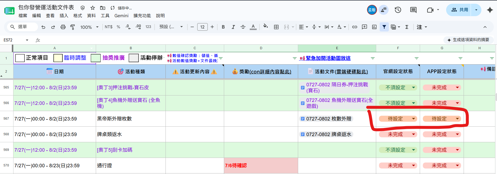

══════════════════════════════════════

### &#x20;**📖 SOP 文件站 - 說明**

══════════════════════════════════════

本專案是用 **MkDocs** + **Material 主題** + **GitHub Pages** 建置的文件站點。

**快速連結：**
- 📌 線上站點：https://yayihuang-bit.github.io/sop-docs/
- 📌 架構說明：[ARCHITECTURE.md](ARCHITECTURE.md)（給 AI 用，包含所有修改指南）
- 📌 GitHub Repo：https://github.com/yayihuang-bit/sop-docs

---

══════════════════════════════════════

### &#x20;**🦆自動發布系統　安裝 \& 使用說明🦆**

══════════════════════════════════════

###### **📄【項目目的性】**

1. 將已完成的文案，自動在後台進行設定，減少人為失誤且節省操作時間
2. 目前已有半自動化項目(官網文章/官網燈箱)，全自動化(定時廣播、跑馬燈)
3. 未自動化項目：APP 燈箱、APP 公告、APP 廣告彈窗、商城燈箱設定

**⚠️*設定完成後請務必再進行二次check，因文件設定後若有後續調整，可能會導致設定上失誤***

\----------------------------------------

##### **⚠️【第一次使用新電腦，請依序完成以下步驟】**

###### **📄【環境需求】**

1\. Node.js　→　[Node.js 官網](https://nodejs.org) 下載 LTS 版本安裝

2\. Google Chrome（電腦通常已有，不需額外安裝）

3\. 需有 VPN 開通[後台](https://backstage.online808.com/login)以及 fileserver，VPN 設定請參考 [VPN 教學文件](https://drive.google.com/drive/folders/12kSNMBHpvaeUGErRM99tWFED5KPWBIQ4?usp=sharing)

4\. [營運排程試算表](https://reurl.cc/8eAGa4) 使用權限

###### **📄【帳號說明】**

- **後台帳號密碼** → 設定後存在 `系統資料/config.json`，每次執行自動套用，不需手動登入
- **Google 帳號** → 登入狀態存在 `系統資料/google_auth/`（瀏覽器 session），**偶爾會過期**，過期時系統會彈出瀏覽器請重新登入，此時執行 `node src/google-login.js` 重新登入即可

---

###### **📄【首次設定】**

─────────────────────────────────────

▶ 使用方式：

&#x20;  1. 點兩下 start.bat 開啟控制台

&#x20;  2. 點右上角 ⚙️

&#x20;  3. 填入 Google 帳號 Email、後台帳號、後台密碼

&#x20;  4. 點「儲存」後關閉設定面板

###### **📄【日常使用方式】**

─────────────────────────────────────

💡 **系統只會發佈試算表上標示為「待設定」的項目，其他狀態的項目一律跳過不處理。**

1\. 點兩下 start.bat　→　開啟控制台

2\. 畫面上方「待設定清單」自動顯示試算表中所有待設定項目

&#x20;  （試算表：https://reurl.cc/8eAGa4）

&#x20;  → 可點「🔄 重新整理」重新掃描

&#x20;  → 每個項目後面標示 \[官網] 或 \[APP] 表示屬於哪個系統

3\. 勾選要本次處理的項目（預設全選）

4\. 選擇要執行的腳本：

&#x20;  ☑ 官網-文章　　→ 【半自動】自動填入文章文字內容到後台

&#x20;     ！！並非每篇文章都會自動化（Docs文件上若沒有標記ai要自動化的，都沒有自動化功能 舉例魚王積分榜)

&#x20;     ！！執行後需手動補上：圖片、獎勵表格

&#x20;     📌 內文欄位讀取的是 HTML 原始碼，需到後台文章編輯器點「原始碼」按鈕複製貼入 Docs

&#x20;     📌 文章內容有修改時，需重新到後台複製最新 HTML 原始碼，更新 Docs 後再將試算表狀態改回「待設定」重新執行

&#x20;  ☑ 官網-廣告設定　→ 【半自動】自動填入廣告資料到後台

&#x20;     ！！執行後請人工確認內容是否正確

&#x20;     

&#x20;  ☑ App-跑馬燈設定　→ 【全自動】從 Docs 讀取資料，自動完成 APP 跑馬燈設定

&#x20;  ☑ App-定時廣播　　→ 【全自動】從 Docs 讀取資料，自動完成 APP 定時廣播設定

&#x20;  （可只勾選需要的腳本，不需要全部執行）

5\. 點「▶ 開始執行」（或設定排程時間後再執行，詳見下方「3.2 執行時間」說明） 

6\. 下方 log 區域會顯示執行進度，完成後試算表狀態自動更新

###### **⚠️半自動項目因需人為確認，所以執行時請務必人在，否則程式有機率卡在同一篇文章⚠️**

###### **📄【中途停止】**

─────────────────────────────────────

執行中可點「⏹ 停止執行」：

&#x20; → 系統立即停止所有腳本

&#x20; → 已成功完成的文件　→　試算表顯示「已完成」

&#x20; → 尚未執行到或中途被停止的文件　→　試算表顯示「設定失敗」

###### **📄【試算表狀態說明】 (https://reurl.cc/8eAGa4)**

─────────────────────────────────────

1. &#x20; 待設定　→ 尚未處理，等待執行
2. &#x20; 已完成　→ 所有腳本執行成功
3. &#x20; 設定失敗→ 有腳本失敗，或執行中途被停止

  跟AI自動化無關的狀態：
4. &#x20; 未完成→項目未完成
5. &#x20; 已暫停→活動暫停
6. &#x20; 不須設定→可能不需要設定文章

###### **📄【常見問題】**

─────────────────────────────────────

Q: 廣告設定執行時出現「您的網際網路存取權遭到封鎖」？

A: 正常現象，不需要手動操作。Windows 防火牆在前一腳本剛關閉 Chrome 後暫時封鎖新開的 Chrome。腳本偵測到這個畫面後會自動等 5 秒重試（最多 3 次），之後會恢復正常。

Q: 控制台開啟後掃描一直轉圈？

A: Google 帳號可能需要重新驗證，

&#x20;  重新執行 node google-login.js 完成登入後再試

Q: 試算表狀態沒有更新？

A: 確認 ⚙️ 設定中的 Google Email 是否填寫正確

Q: 出現「腳本不存在」紅字？

A: 對應的 .js 檔案不在 auto-post-playwright-2 資料夾中，

&#x20;  請確認檔案是否遺失

Q: 其他文件該如何也自動化

A: 請依照其他同樣有自動化的文件格式去填寫

※官網文章範例：

直接建立一個副本，確認官網文章的標題符合：一、🤖官網設定-文章管理-AI自動化用  

下方資料須包含

類別：最新消息>營運

標題：  小雞世足應援包！限時110%優惠！手刀衝刺買起來！

內文：

原始碼

上架時間

符合以上條件，則系統會自動判斷

&#x20;※文章原始碼可到後台的文章區塊，切換【原始碼】，複製他即可，主要是為了保持文章的格式

══════════════════════════════════════

###### **📄腳本修改說明（開發者參考）　※若不好手動更新，建議透過AI處理**

══════════════════════════════════════

###### **📄【腳本檔案位置】**

─────────────────────────────────────

所有腳本都在 `src/` 資料夾，設定檔在 `系統資料/` 資料夾：

&#x20; 系統資料/config.json      → 後台網址、帳號密碼設定

&#x20; src/ui-server.js          → 控制台 UI（由 start.bat 啟動）

&#x20; src/run-from-sheet.js     → 主流程（讀試算表 → 執行各腳本 → 更新狀態）

&#x20; src/scan-sheet.js         → 掃描試算表，找出「待設定」列

&#x20; src/auto-post-article.js  → 官網文章腳本

&#x20; src/auto-post-ad.js       → 官網廣告設定腳本

&#x20; src/auto-post-marquee.js  → APP 跑馬燈設定腳本

&#x20; src/auto-post-broadcast.js → APP 定時廣播設定腳本

7.1 後台網址或帳密

─────────────────────────────────────

直接編輯 config.json：

&#x20; {

&#x20;   "backstage": {

&#x20;     "url": "https://your-backstage.com",   ← 後台網址（不要加 /login）

&#x20;     "username": "帳號",

&#x20;     "password": "密碼"

&#x20;   },

&#x20;   "google": {

&#x20;     "email": "your@gmail.com"

&#x20;   }

&#x20; }

7.2 換一份試算表

─────────────────────────────────────

需要改兩個檔案頂端的兩個變數：

&#x20; 檔案：run-from-sheet.js  和  scan-sheet.js

&#x20; 位置：各檔案最開頭幾行

&#x20; const SHEET\_ID  = '這裡填試算表 ID';

&#x20; const SHEET\_GID = '這裡填分頁 ID';

試算表 ID → Google Sheets 網址中 /d/ 後面那串

&#x20; 範例網址：https://docs.google.com/spreadsheets/d/【這裡是ID】/edit

分頁 ID → 網址 #gid= 後面的數字

&#x20; 範例網址：https://docs.google.com/spreadsheets/d/xxx/edit#gid=【這裡是GID】

7.3 Google Docs 的欄位名稱

─────────────────────────────────────

腳本透過「欄位名稱：值」的格式讀取 Google Docs 的內容。

如果 Docs 文件裡的欄位標題改名了，需要同步修改腳本。

在各腳本中找到 get('欄位名稱') 的那段：

&#x20; const extracted = {

&#x20;   content:  get('跑馬燈內容'),    ← 這裡的字串 = Docs 裡冒號左邊的標題

&#x20;   count:    get('出現次數'),

&#x20;   interval: get('出現間隔'),

&#x20; };

&#x20; 規則：Docs 裡寫「跑馬燈內容：xxx」→ 腳本裡就填 '跑馬燈內容'

必填驗證也要跟著改（get() 那段下方幾行）：

&#x20; if (!extracted.content)  missingFields.push('跑馬燈內容');

7.4 Google Docs 的區段標題

─────────────────────────────────────

腳本用區段標題來定位要讀哪一段內容。

如果 Docs 文件的大標題改名了，需要同步更新腳本。

每個腳本頂端有 ALL\_SECTIONS 陣列，以及後段的 extractSection() 呼叫：

&#x20; const ALL\_SECTIONS = \[

&#x20;   '官網設定-文章管理-QA測試用',

&#x20;   '官網設定-廣告設定',

&#x20;   'APP-公告系統-跑馬燈設定',   ← 這裡要跟 Docs 裡的標題完全一樣

&#x20;   'APP-客服系統-定時廣播',

&#x20; ];

&#x20; // 後段：

&#x20; const sectionText = extractSection(allText, 'APP-公告系統-跑馬燈設定');

&#x20;                                             ↑ 這裡也要一起改

&#x20; 兩個地方改成一樣的名稱即可。

7.5 後台表單操作（Playwright selector）

─────────────────────────────────────

如果後台網頁改版，按鈕或欄位文字變了，腳本中對應操作也要更新。

常見寫法：

&#x20; await page.getByRole('textbox', { name: '跑馬燈內容' }).fill(value);

&#x20;                                        ↑ 對應後台頁面上輸入框旁的標籤文字

&#x20; await page.getByRole('button', { name: '確定新增' }).click();

&#x20;                                        ↑ 對應後台頁面上按鈕的文字

&#x20; 修改方式：把 name 裡的字串改成後台頁面實際顯示的文字即可

找不到元素時，可雙擊 `點我錄製腳本.bat` 重新錄製，將產生的程式碼交給 AI 協助更新腳本。

7.6 新增一個全新的自動化腳本

─────────────────────────────────────

1. 雙擊 `點我錄製腳本.bat`，在開啟的後台瀏覽器中錄製你想自動化的操作流程
2. 把錄製產生的程式碼複製起來，丟給 AI，說明：「我要新增一個自動化腳本，請依照現有腳本的格式幫我整合進去」
3. AI 會處理所有技術細節（腳本建立、控制台整合、試算表狀態更新）

💡 建議把 `使用說明.html` 和 `參考文件/` 資料夾一起提供給 AI，讓它了解系統架構再動手。

