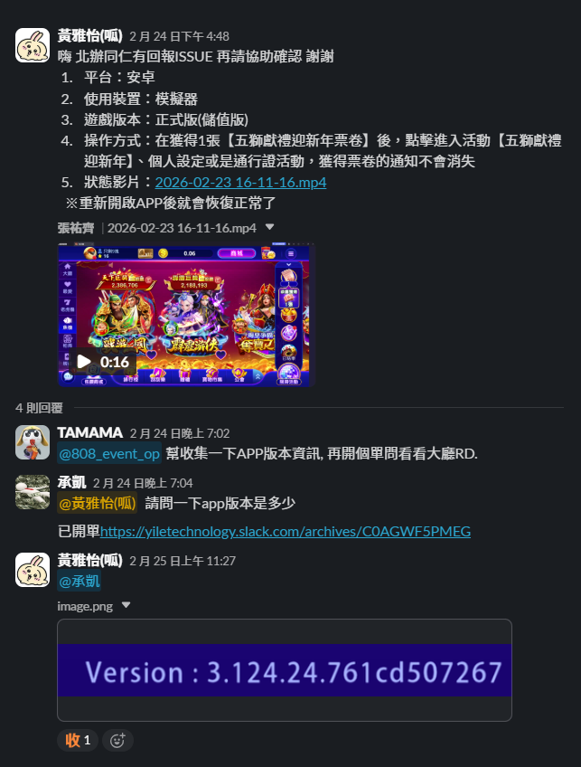

<p style="font-size:2em; font-weight:bold; margin:20px 0 8px 0; display:flex; align-items:center; gap:8px;"> BUG回報方式 </p>

> 版本：v1.0　撰寫日期：2026-08-12　BY yayihuang-bit
> ⚠️ 版本、撰寫日期、BY 都需要手動填寫更新

## 說明

發現 BUG 時，統一於 Slack 群組留言回報，依照固定格式描述問題，方便窗口（RD/QA）快速理解狀況並開單處理。

## 回報格式

於 Slack [BUG回報群組](https://yiletechnology.slack.com/archives/C0961JG58V8) 依以下格式留言：

```
1. 平台：安卓/IOS
2. 使用裝置：模擬器/手機
3. 遊戲版本：APK／IAP版(雙平台)，版本號：
4. 操作方式：（描述重現步驟，需清楚到對方能重現問題）
5. 狀態影片：（附上截圖或錄影連結）
```

版本號可於遊戲載入畫面查看：


範例：



## 注意事項

⚠️ 如果問題本身難以重現，可以判斷問題是否足夠嚴重會影響營運（類似遊戲閃退、斷線、賠錢等可能性），可立即回報請 QA 協助重現

回報完問題後，問題成立 OP 會開單，有興趣可自行追蹤狀態；問題有結論後，OP 會將單結案
