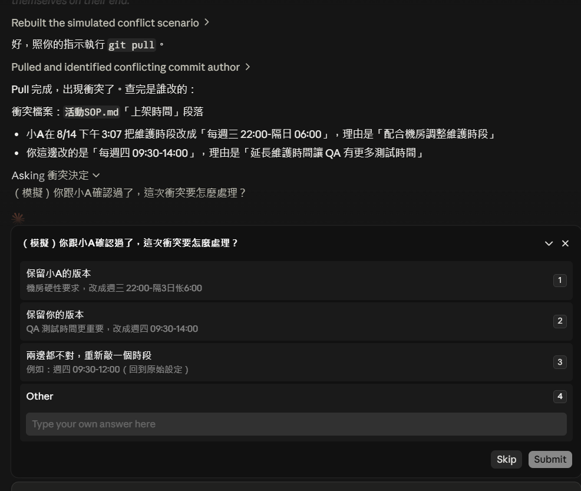

 Git 版本推送與衝突處理 

> 版本：v1.0　撰寫日期：2026-08-14　BY yayihuang-bit
> ⚠️ 版本、撰寫日期、BY 都需要手動填寫更新

## 說明

- **PUSH（推送）**：把自己電腦上改好的內容，上傳同步到 GIT 上的最新版本
- **PULL（拉取）**：把 GIT 上別人已經上傳的最新版本，下載同步回自己電腦

因 GIT 多人使用時，可能會 A 跟 B 同時在調整，但 B 推上去版本後，A 電腦上的還是舊版本，後續 A 要上傳檔案時，就會發現版本衝突

<mark>**建議大家編輯時，可以先從 GIT PULL 檔案到最新版本，並且完成後儘快 PUSH 檔案上 GIT**</mark>

## push 前沒有先同步，會發生什麼事

如果別人已經把新的內容推上去，這時候直接 push 會被拒絕（rejected, fetch first），**不會**把對方的內容蓋掉。必須先把對方的更新拉下來（pull），才能繼續推送。

## 什麼情況才算真的衝突

只有兩人改到**同一份檔案的同一段內容**時才會產生衝突，需要人工選一個版本留下來。如果是改不同檔案、或同一份檔案的不同段落，會自動合併，不需要處理。

## 衝突處理流程

1. AI 主動查出這段內容是誰改的、什麼時候改的、改了什麼（不需要自己下指令查）
2. 自己去找對方確認，要保留哪一版、還是兩邊都要留
3. 把確認後的決定告訴 AI
4. AI 依照決定把衝突內容處理好，重新推送

實際狀況範例：

<mark>**全程只需要做第 2 步（去找對方確認），其他 git 操作都由 AI 處理，不用自己學指令**</mark>
