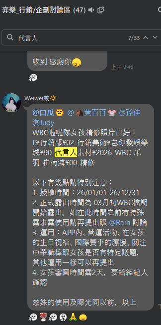

 代言人更新流程 

> 版本：v1.0　撰寫日期：2026-08-14　BY yayihuang-bit
> ⚠️ 版本、撰寫日期、BY 都需要手動填寫更新

## 說明

代言人相關更新分兩種狀態：

1. [新代言人更換](#new-endorser)：原本的代言人整個換成新的人
2. [同代言人圖面更新](#update-visual)：代言人不變，只是更新圖面素材

<mark>**目前代言合作狀態分三種等級（由高到低：代言人、推廣大使、簽平面合作），合約內容跟名稱不同，平面圖上使用的稱謂要特別注意**</mark>

- 代言人：品牌形象代表，等級最高（[代言人範例](https://activity.online808.com/20241107/)）
- 推廣大使：等級次之（[推廣大使範例](https://activity.online808.com/20241107/)）
- 簽平面合作：僅平面素材授權，等級最低（[簽平面合作範例](https://online808.com/other/3312)）

簽平面合作的授權範圍、露出時間、審圖天數等細節通常會列在窗口溝通的訊息裡，示意如下：

合作狀態的等級會影響換皮上可使用的範圍，舉例：代言人是品牌形象，icon 換皮一定要達到「代言人」等級才能用，「平面合作」不行

## 新代言人更換

🟡 待補充

## 同代言人圖面更新

圖面授權每年會做更換，需於 1/1 進行更換；若時間上需要調整，可與行銷溝通並與代言人確認。

<mark>**由於跨年時，肖像權更新時間會跟版本送審時間產生落差——例如使用權到 1/1 到期，但下一版正式更新要到 1/8 才上線，這種情況請行銷跟代言人窗口協調**</mark>

**APP 相關**

1. APP icon
2. APP 登入 Loading 頁
3. APP 新手教學：代言人素材改用「新造型」，選擇的遊戲與相關台詞不變更
4. 下架前一年度代言人貼圖

**官網相關**

1. 官網主題皮
2. [官網防詐騙宣導](https://online808.com/news/1559)
