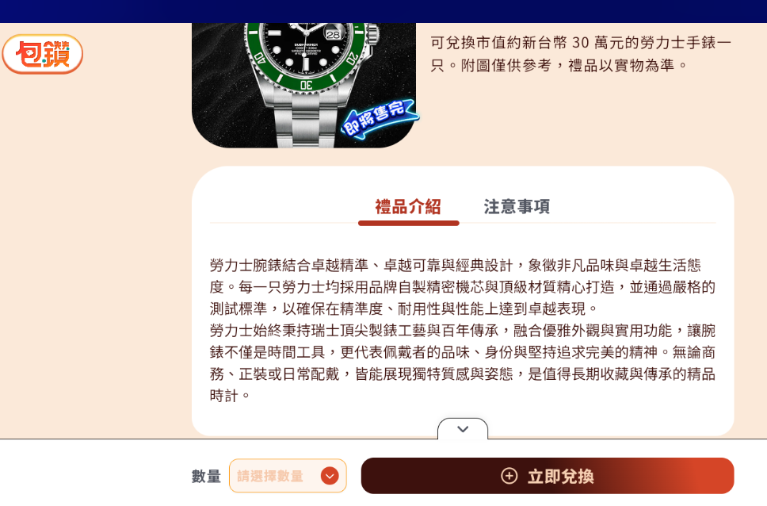
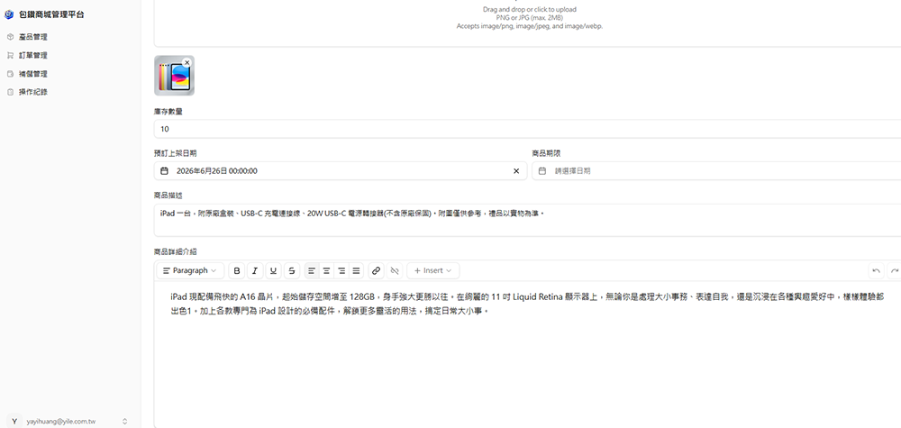
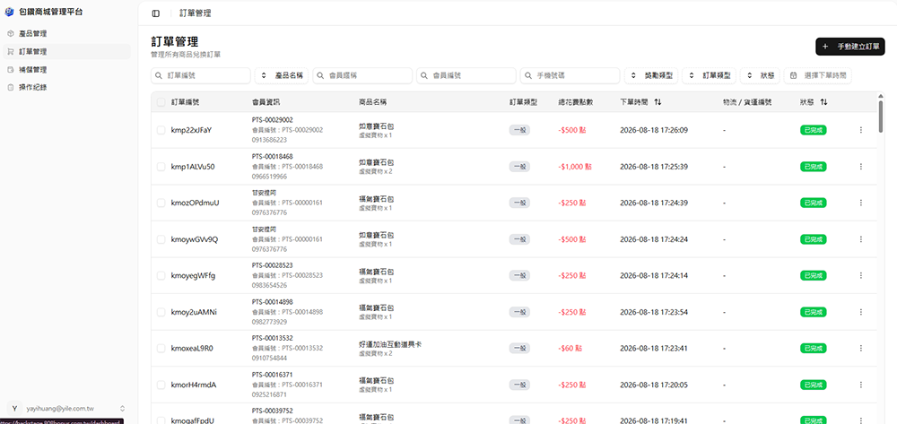

 包鑽商城 

> 版本：v1.0　撰寫日期：2026-08-17　BY yayihuang-bit
> ⚠️ 版本、撰寫日期、BY 都需要手動填寫更新

## 說明

包鑽點數是一種虛擬點數，可在遊玩過程中取得，點數可於包鑽商城兌換想要的物品。

- [包鑽 QA 網頁](https://qa.808bonus.com.tw/)
- [包鑽 QA 後台](https://qa-backstage.808bonus.com.tw/dashboard)
- [包鑽正式站後台](https://backstage.808bonus.com.tw/auth/sign-in?returnTo=%2Fdashboard)
- [包鑽商品列表](https://drive.google.com/drive/folders/1OodDwMiVUvvyT0VBWQafHfe32-upGCXK)
- [包鑽商品訂單狀態](https://docs.google.com/spreadsheets/d/1blgjSZMH11F8O67TRMhqv87T-1TA8Io-UyNQijpG15I/edit?gid=2059925614#gid=2059925614)
- 包鑽商品圖 Fileserver：`I:\行銷部\02_行銷美術\包你發娛樂城\00_output_網頁拆圖檔\包鑽網站_網頁拆圖檔`

## 研發商品流程

🟡 之後要補流程圖

1. 前期市場調查完畢後，規劃新產品資料，確認後記錄到[所有商品列表](https://docs.google.com/spreadsheets/d/1v2pGobWxheuHk7v-mSV8BjBXJutBcsPo3YkSRkquaig/edit?gid=196088448#gid=196088448)

2. 完成後，規劃當季要上的[上架商品列表](https://docs.google.com/spreadsheets/d/1v2pGobWxheuHk7v-mSV8BjBXJutBcsPo3YkSRkquaig/edit?gid=1065033648#gid=1065033648)

3. 在商品對應的分頁，寫上[商品介紹](https://docs.google.com/spreadsheets/d/1v2pGobWxheuHk7v-mSV8BjBXJutBcsPo3YkSRkquaig/edit?gid=1786736022#gid=1786736022)

    寫的內容會顯示在商品頁的「禮品介紹」，示意如下：

    

4. 需於預計上架商品日前，於[包鑽正式站後台](https://backstage.808bonus.com.tw/auth/sign-in?returnTo=%2Fdashboard)「產品管理」設定上架資料，並填寫商品的描述與介紹

    

5. 新一季時，會執行上架商品資料或下架商品；下架商品也需從「產品管理」調整

## 訂單出貨流程

會在[包鑽正式站後台](https://backstage.808bonus.com.tw/auth/sign-in?returnTo=%2Fdashboard)的「訂單管理」看到玩家訂單。

1. 上架後，若有玩家訂購，則確定是否有貨
2. 若沒有貨，則要補貨
3. 有貨的話，則調整玩家狀態，準備出貨
4. 完成後，將狀態調整為「已出貨」

🟡 待補充：補貨相關細節
