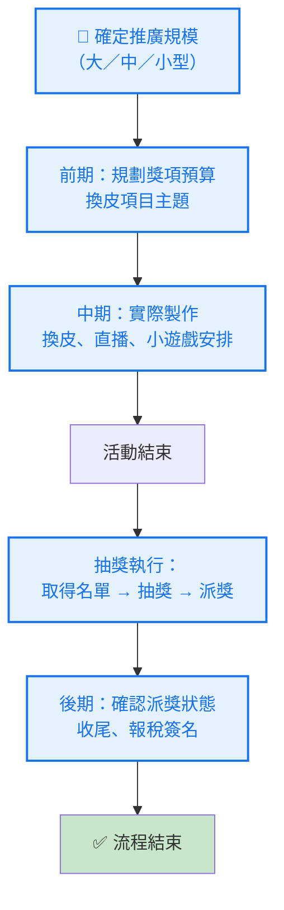
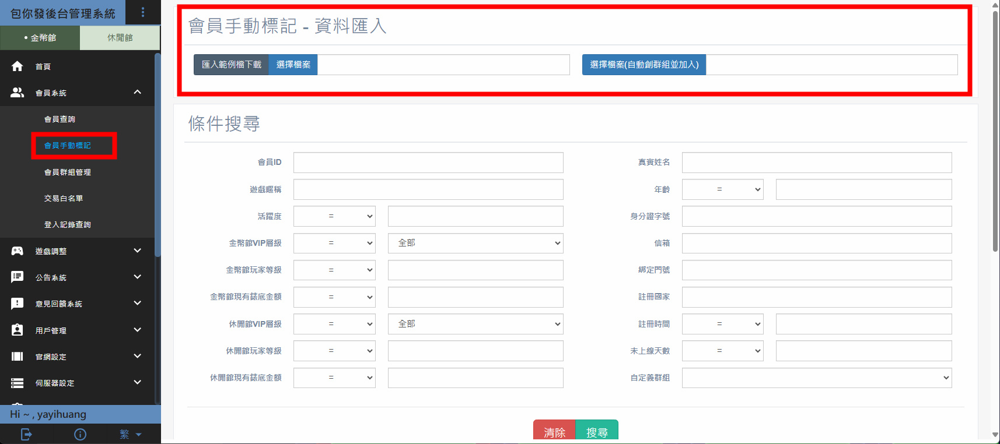
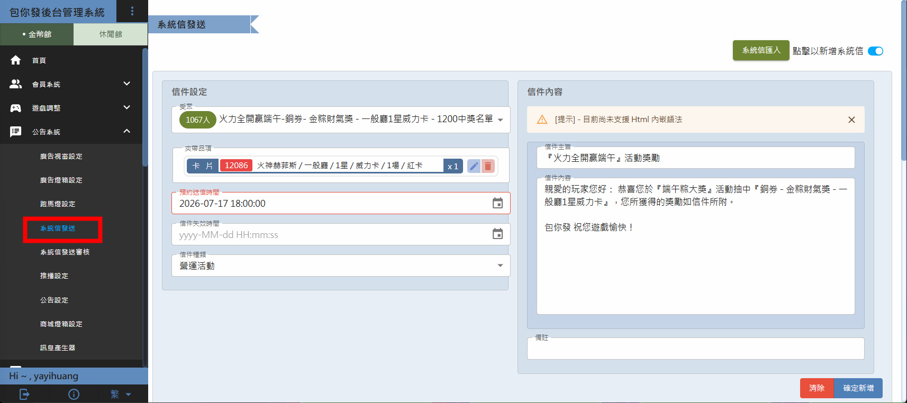
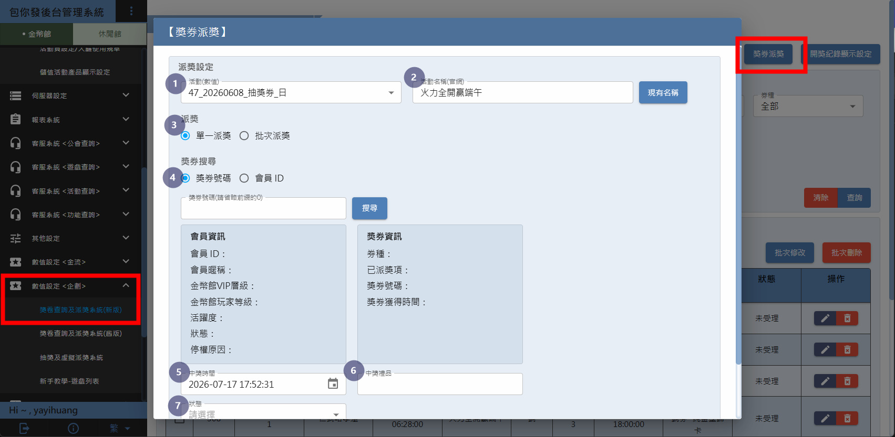
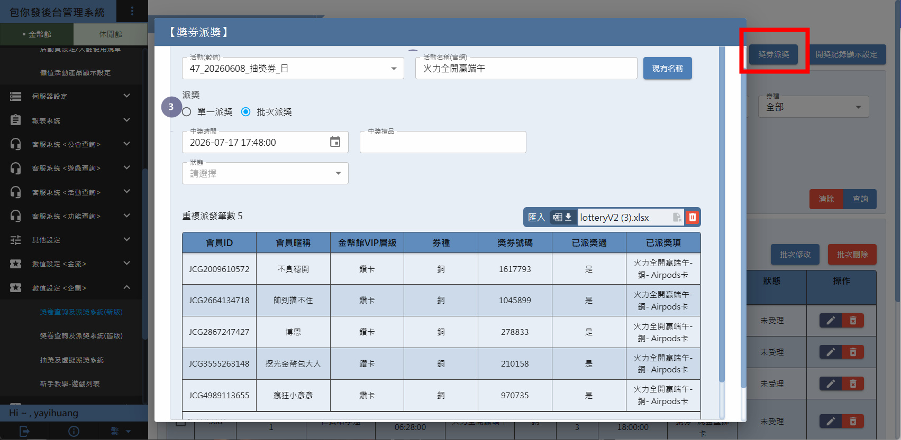
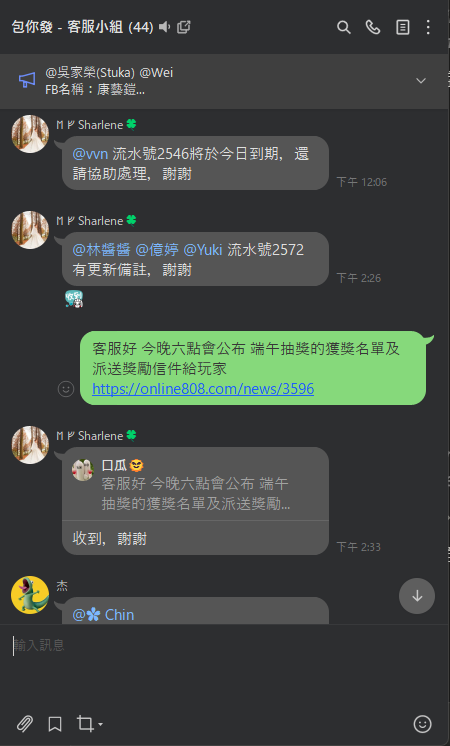

[← 返回抽獎](/sop-docs/抽獎_索引/)

---

 抽獎券推廣流程 

> 版本：v1.0　撰寫日期：2026-06-26　BY yayihuang-bit
> ⚠️ 版本、撰寫日期、BY 都需要手動填寫更新

## 🔄 整體流程圖（藍框項目，點擊可跳至對應說明區）

## 推廣規模說明

<mark>**規劃前可先與米乓確認規模，因以下推廣等級僅供參考（仍會依照市場狀態做浮動調整）**</mark>

<table style="width:100%; table-layout:fixed;">
<thead><tr>
<th style="width:12%">等級</th>
<th style="width:30%">類型</th>
<th style="width:43%">常態安排</th>
<th style="width:15%">範例</th>
</tr></thead>
<tbody>
<tr><td>大型推廣</td><td>雙頭獎</td><td>過年、中秋</td><td><a href="https://activity.online808.com/20260205/index.html" target="_blank">參考</a></td></tr>
<tr><td>中型推廣</td><td>單頭獎</td><td>周年慶、端午</td><td><a href="https://activity.online808.com/20260608/index.html#/active_01" target="_blank">參考</a></td></tr>
<tr><td>小型推廣</td><td class="wrap">單頭獎（獎金 &lt; 50 萬，不直播）</td><td class="wrap">運動賽事或非以上的其他時間（具體特殊檔期的推廣力度可事先與米乓確認）</td><td><a href="https://online808.com/news/3345" target="_blank">參考</a></td></tr>
</tbody>
</table>

## 時間規劃

<table style="width:100%; table-layout:fixed;">
<thead><tr>
<th style="width:28%">時間點</th>
<th style="width:47%">動作</th>
<th style="width:25%">範例（5/1～5/10 活動）</th>
</tr></thead>
<tbody>
<tr><td>活動前 2 個月</td><td class="wrap">執行換皮跟抽獎推廣安排</td><td>3/1</td></tr>
<tr><td>活動前 1 個月</td><td class="wrap">最晚定案（提交米乓完成預算審核）</td><td>4/1</td></tr>
<tr><td class="wrap">活動結束前 1 個月</td><td class="wrap"><a href="/sop-docs/直播流程/">執行腳本 + 小遊戲安排</a></td><td>4/10</td></tr>
<tr><td>活動結束後 禮拜三</td><td>直播時間</td><td>5/13</td></tr>
<tr><td>活動結束後 禮拜五</td><td class="wrap"><a href="https://drive.google.com/drive/folders/1SITz3IJ8xlLk8Ri3s0a56AAtWS_rEDN5" target="_blank">執行抽獎 + 紀錄名單</a>（<a href="{{ links.winner_list_tool }}" target="_blank">中獎名單製作工具</a>）、<a href="{{ links.winner_announcement_example }}" target="_blank">抽獎名單公告</a>、派獎、設定發送獎勵確認單 ⚠️（只有實體獎勵包裝才需要，寶石卡片不需要做獎勵確認單流程）</td><td>5/15</td></tr>
<tr><td class="wrap">確認單截止前 3 天</td><td class="wrap"><a href="{{ links.confirm_notice_template }}" target="_blank">寄送通知信</a>給尚未完成確認單的玩家</td><td>6/2</td></tr>
<tr><td class="wrap">中獎名單公布後 第 3 個禮拜</td><td class="wrap"><a href="https://docs.google.com/spreadsheets/d/1dFCTpVRZ83hpXBf30RuOF90NLerkPe79EBz3egiGqz4/edit?gid=1930812069#gid=1930812069" target="_blank">獎勵確認單</a>回收（小型推廣可縮短在 1～2 週內）</td><td class="wrap">6/5（小型推廣 5/22～5/29）</td></tr>
<tr><td class="wrap">確認單回收後當周的下周 禮拜五</td><td><a href="{{ links.reward_dispatch }}" target="_blank">派獎</a>（信件範本）</td><td class="wrap">假設 6/5 回收完 → 6/12</td></tr>
<tr><td>派獎後</td><td class="wrap">負責窗口提供報稅單，簽名確認</td><td>6/12 後</td></tr>
</tbody>
</table>

> 以上時間為大方向參考，實際可依活動規模與狀況彈性調整。

## 執行流程

### 前期（規劃獎項預算、換皮項目主題）

1. 營運窗口確認 [活動時程](https://docs.google.com/spreadsheets/d/1B9F0DOBFTuBSmCbz3zaJ5ksPCbh6PJNAPoh-jsonVyQ/edit?gid=1985174151#gid=1985174151)，將[抽獎]({{ links.ticket_reward_content }})與[換皮](https://yayihuang-bit.github.io/sop-docs/%E6%8F%9B%E7%9A%AE%E8%B3%87%E8%A8%8A_%E7%B4%A2%E5%BC%95/)項目排入時程

2. 營運企劃開始安排[獎項內容]({{ links.ticket_reward_content }})、[換皮](https://yayihuang-bit.github.io/sop-docs/%E6%8F%9B%E7%9A%AE%E8%B3%87%E8%A8%8A_%E7%B4%A2%E5%BC%95/)內容初版

    <mark>**獎項內容如使用實體物品的平面圖（舉例：車子），該物品實際價格不得超過獎金總額 + 30 萬（例如獎金 150 萬，最多只能挑選車價 180 萬以內的車款平面圖）**</mark>

    <mark>**至於車款廠牌的挑選，可以評估品牌優劣勢，與行銷討論後再提案**</mark>

3. 與行銷窗口討論換皮與獎項規劃（[獎項規劃簡報]({{ links.reward_slides }})）

4. 與營運、數學窗口討論做初版定案討論

5. 將獎項總預算、規模、各項目提供給米乓審查

6. 同步獎勵結論給行銷、行美（[獎項規劃簡報]({{ links.reward_slides }})）

7. 提供活動主副標給行銷做最終確認（主副標有文字長度限制，完成的主副標要填到[這裡](https://docs.google.com/spreadsheets/d/1QLXHs-ObTqAVVp1uwm841Lcsq3lhQAXJJslqW5wVq84/edit?gid=1161207418#gid=1161207418)）

8. 製作活動文件

9. 釋出至 Slack [包你發營運組]({{ links.ops_group_slack }})

### 中期（實際製作與直播安排）

1. [換皮](/sop-docs/換皮資訊_索引/)項目執行、[推廣活動頁](/sop-docs/換皮資訊_索引/)、[官網換皮製作](/sop-docs/換皮資訊_索引/)

2. [直播腳本、小遊戲](https://yayihuang-bit.github.io/sop-docs/%E7%9B%B4%E6%92%AD%E6%B5%81%E7%A8%8B/)製作準備

### 抽獎執行

1. 活動結束後抽獎，數據會在活動結束後兩天提供名單（因抽獎券有轉輪機制），並請數據更新[抽獎券分取得門檻的數據]({{ links.ticket_threshold_data }})，更新完同步資訊到 Slack [數學企劃群](https://yiletechnology.slack.com/archives/C0885BTTSEQ)

2. 名單放入後台進行[抽獎](https://drive.google.com/drive/folders/1CjqkNgeIzHWZwuGWJvZiXtmYrGuJ3Jt3)

    <mark>**目前只有超過 1,000 個中獎名額的可同一位重複中獎（但券號也不能重複）**</mark>

3. 貼入[中獎名單](https://drive.google.com/drive/folders/1BsBRO7R26gIOXk9VuWO8keJDeY4IhoHC)數據，並檢查是否有重複券號

4. 後台創立玩家群組

    <mark>**須注意後台群組不能有重複玩家，有重複的那一組獎勵需要把重複與不重複的各創一個玩家群組**</mark>

    

5. 與數學確認卡片送的是哪款遊戲（通常威力卡都是當期推廣的遊戲）

6. 派發獎勵[信件]({{ links.reward_letter_template }})（信件範本），與 CRM 通知目前正在派獎，需要作業時間（因為大家可能同時都在審核獎勵）

    

7. 請營運其他人審核中獎名單

8. 製作[中獎名單]({{ links.winner_list_tool }})（[參考範例]({{ links.winner_announcement_example }})）

9. 派發實體獎勵確認單：派發除了直播以外的獎勵（例如 AirPods 卡，需要玩家填寫獎勵確認單），到後台「數值設定-企劃」→「獎券查詢及派獎系統」操作，中獎時間填中獎名單公布的時間、狀態選「未受理」

    

    

10. 於 LINE 客服群組通知派獎及中獎名單釋出時間

    

### 後期（確認派獎狀態收尾）

1. 活動結束前三天，[寄送通知]({{ links.confirm_notice_template }})給尚未完成[確認單](https://docs.google.com/spreadsheets/d/1dFCTpVRZ83hpXBf30RuOF90NLerkPe79EBz3egiGqz4/edit?gid=627549162#gid=627549162)的玩家，並同步客服已寄出信件

2. 派獎當天通知客服有派獎

3. 獎券派獎狀態改為「已發送」，若未成功送出的獎券狀態改成「已過期」

4. 報稅簽名完成後，流程結束

5. 請數據更新[抽獎券數據]({{ links.ticket_threshold_data }})，並同步到企劃數學群

## 注意事項

- 若有玩家在截止收單後仍要求派獎，需評估玩家的 VIP 等級，與米乓確認是否補派獎勵，並回覆客服此為特例處理
- 部分玩家是包你發 VIP，所以派獎方式跟給資料的方式會由企劃代為處理
