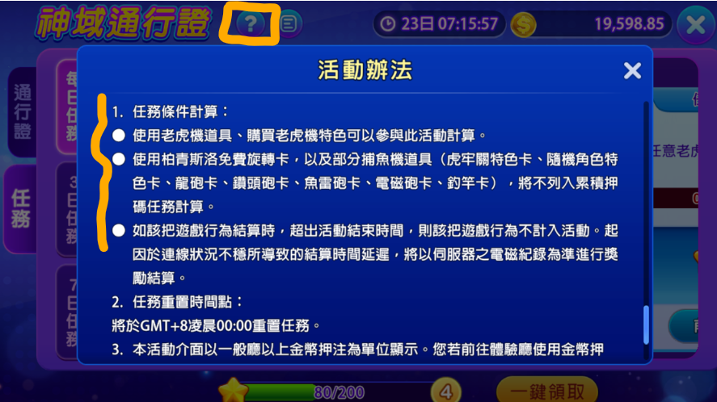
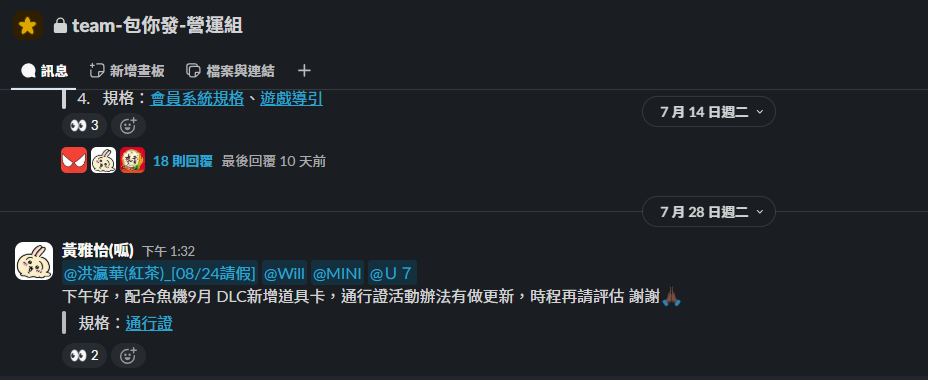
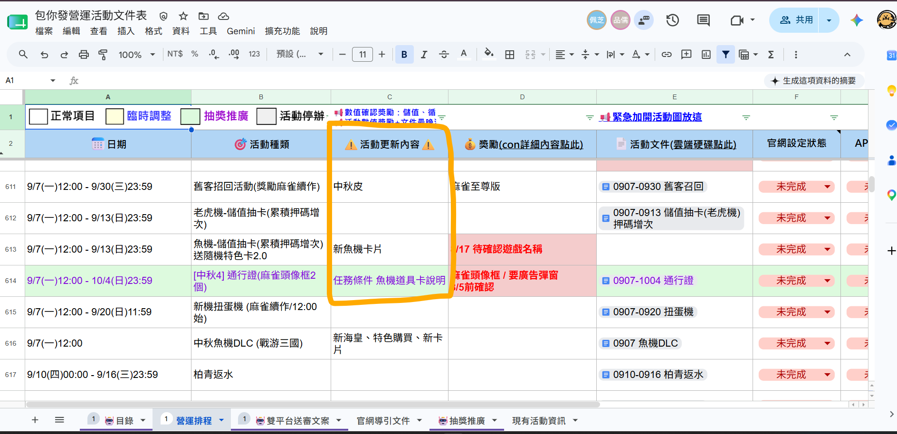

[← 返回首頁](/sop-docs/)

---

 文案調整流程 

> 版本：v1.0　撰寫日期：2026-07-31　BY yayihuang-bit
> ⚠️ 版本、撰寫日期、BY 都需要手動填寫更新

## 說明

遊戲／活動 info／官網表格區更新時，判斷是否要跟著調整文案。

## 什麼時候要調整

- **不用調整**：獎勵、日期變動——多數項目已預留浮動空間，自動讀取數學數值
- **要調整，好記**：全新開發的項目（例如通行證新增機制），開發流程本來就會一起更新
- **要調整，⚠️ 容易忘**：既有活動被「其他更新」連帶影響（例如魚機更新，可能波及通行證、魚王積分榜、魚機積分任務、抽獎券）。負責這個更新的通常是**不同的開發單位**，加上這類項目沒有自動讀取數值的空間、也沒人專責檢查，最容易漏掉

## 容易被波及的項目範例

- **通行證**：任務條件計算

    

- **魚王積分榜**：新增遊戲、新海皇的積分

- **魚機積分任務**：新增遊戲、新海皇

- **抽獎券**：有新遊戲時要更新

## 更新流程

以新魚機為例：

1. 盤點項目影響活動範圍

2. [包你發更新計畫表]({{ links.update_plan_sheet }})確認上線時間，與 mini 同步更新內容

3. 更新[活動規格](https://drive.google.com/drive/folders/15Qzi5Hl75W9MeXPmoFbSLFHN9-VSSOeK)

4. 完成後在 Slack [包你發營運組]({{ links.ops_group_slack }})同步給開發單位

    

5. 在[營運文件總覽]({{ links.campaign_doc_sheet }})中，活動更新內容註記更新內容

    

6. 更新[活動自動化範本](https://docs.google.com/spreadsheets/d/1uIYYoJn2iYkWIx9oZLdABD2x1kUtnI8dEem9Uv0QbGc/edit?gid=1716214522#gid=1716214522)
