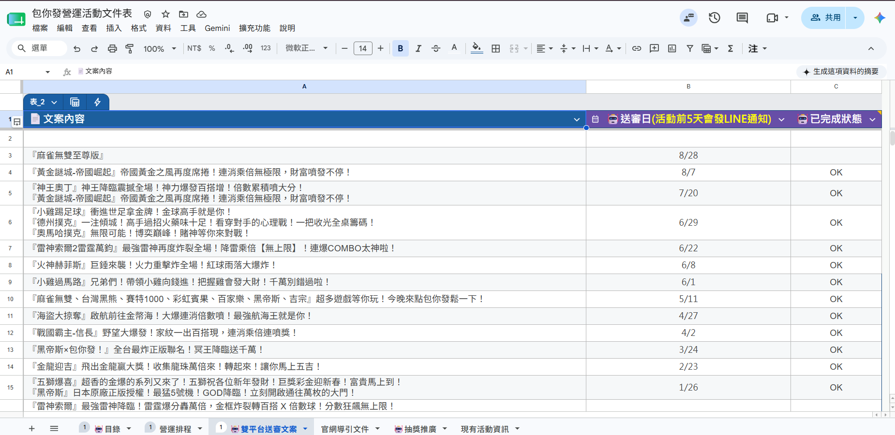
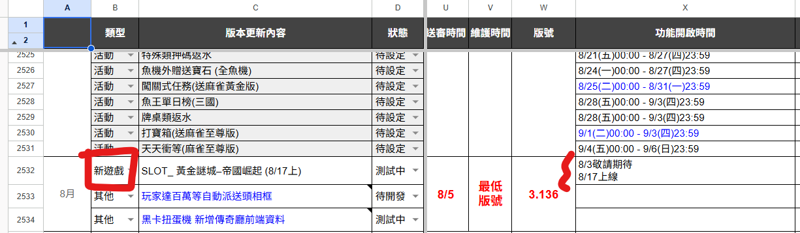
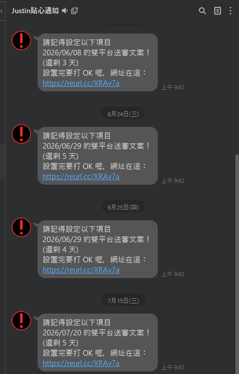

 營運文案寫法 

> 版本：v1.0　撰寫日期：2026-08-11　BY yayihuang-bit
> ⚠️ 版本、撰寫日期、BY 都需要手動填寫更新

## 說明

怎麼寫營運相關的文案，包含雙平台送審用的文案，以及營運活動本身的文案寫法。

## 雙平台文案寫法（IOS/安卓送審用）

送審就是 APP 交由 Android、iOS 審查。[雙平台文案表]({{ links.dual_platform_copy_sheet }})的送審日依照[包你發更新計畫表]({{ links.update_plan_sheet }})規劃，也能查到每次送審對應的遊戲及上線時間。

⚠️ 這張雙平台文案表是要企劃根據包你發更新計畫表去維護的。

LINE 通知是用 Google Script 程式自動排程腳本發的：檢查雙平台文案表裡每一列的送審日期，只要日期在 5 天內（含當天）而且狀態欄不是「OK」，就會發一則 LINE 廣播提醒，所以設定完文案後**記得把狀態改成「OK」**，不然每天都會一直收到提醒。

⚠️ 要收到這個通知，要先加入 [LINE 帳號](https://line.me/R/ti/p/@936hkopb)。

<mark>⚠️ **如果文案寫完要修改，但已經過了送審時間，可以找前端紅茶，詢問是否能調整**</mark>

## 怎麼挑要寫的遊戲

要挑**距離維護日最近**的遊戲來寫。舉例：假設這 4/28 一包送審有三款遊戲：

- a：5/5 上線
- b：5/15 上線
- c：5/30 上線

送審完成的版本 5/4 上線那天，通常 a 跟 b 遊戲都已經曝光了（可看是否已經有「敬請期待」）。那就會寫 a 跟 b，不會寫 c，因為對外界來說 c 遊戲還沒有任何消息。

⚠️ 假設這次送審沒有任何遊戲，就可以寫當下現在最新的遊戲。

## 遊戲雙平台寫法

可以參考過往的範例，主要是**遊戲名稱＋遊戲特色**。

- 可以到 [QA 站 APP]({{ links.qa_app_install_folder }})玩看看遊戲
- 或者看數學釋出的[官網 Help]({{ links.game_website_info_folder }})了解玩法
- 倍數部分可以詢問負責的數學

## 營運活動文案寫法

🟡 待補充
