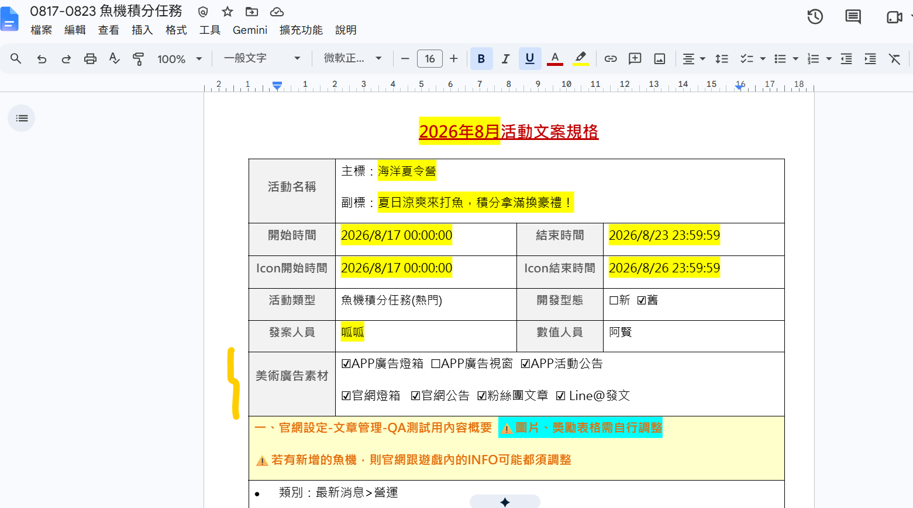
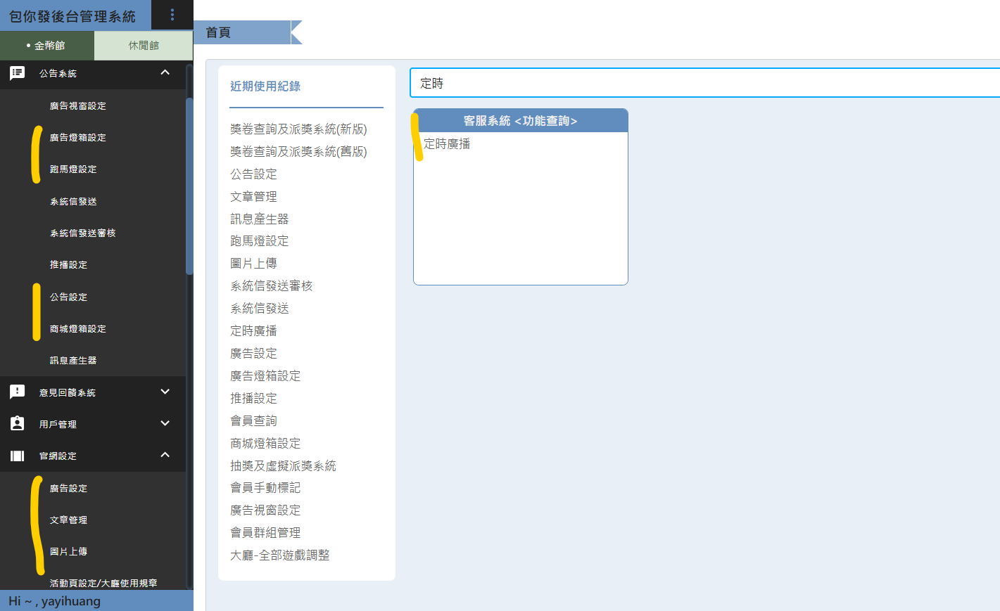
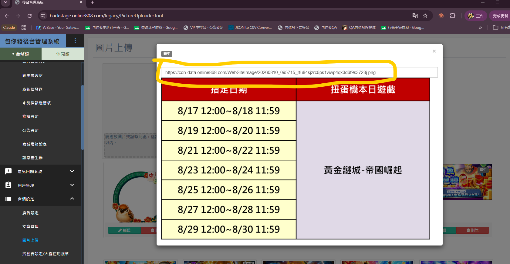
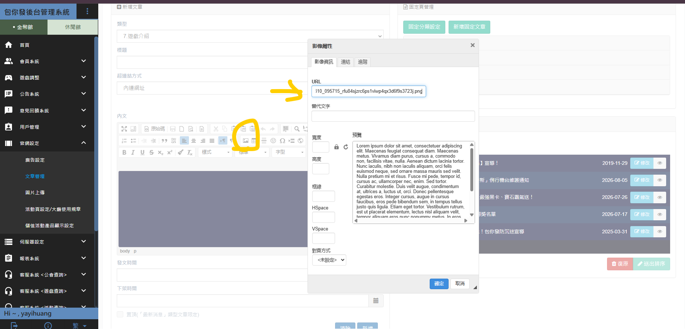
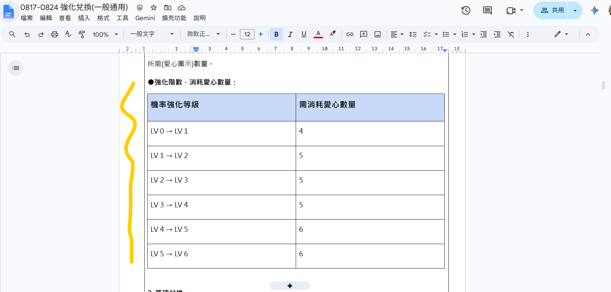
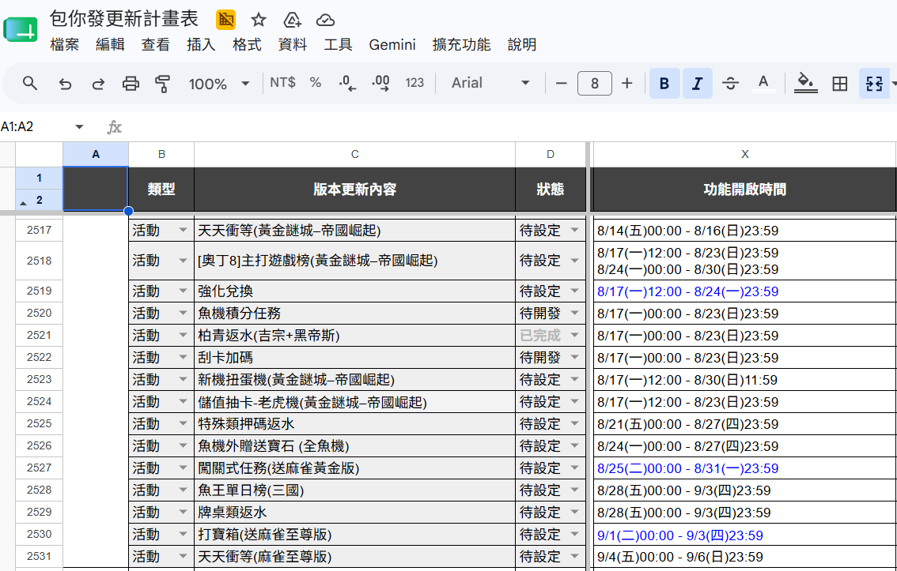
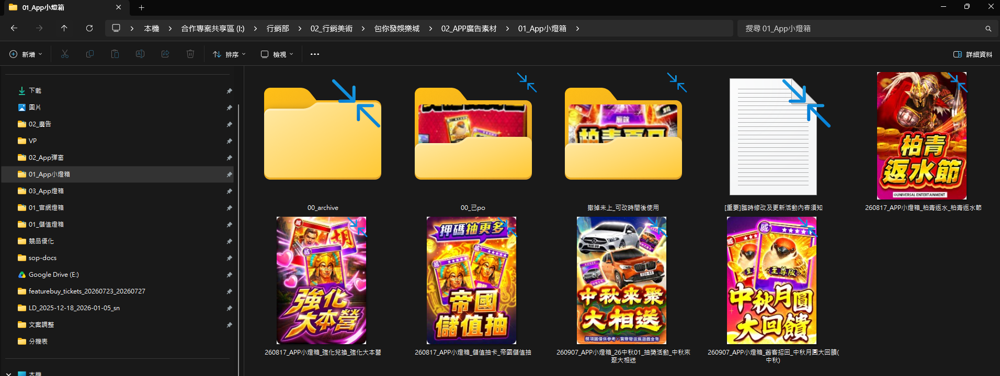

 後臺設定營運活動公告 

> 版本：v1.0　撰寫日期：2026-07-31　BY yayihuang-bit
> ⚠️ 版本、撰寫日期、BY 都需要手動填寫更新

## 說明

活動的獨立開案、寫活動說明、出文案，這幾個前置步驟不屬於這裡（不是這邊負責的範圍）。

這份文件只講**針對後台設定文章**——文案已經寫好之後，怎麼在後台把這篇活動文章設定出來，不需要自己生成任何文件。

## 設定時間點

通常在活動開始前兩週開始設定，最晚是活動開始前 1 天，詳細排期見[營運文件總覽]({{ links.campaign_doc_sheet }})。

⚠️ **特例狀態**：圖片未完成、臨時插件，可先設定文字版

## 廣告素材類型

從[營運文件總覽]({{ links.campaign_doc_sheet }})打開活動文件後，可以看到這個活動有的廣告素材類型：

- **需要圖片**：APP廣告燈箱、APP公告、官網燈箱、官網公告
- **只要設定文字**：跑馬燈、推播

⚠️ 後台「官網設定－文章管理－AI自動化用」這個區塊先無視，這是之後操作到自動發布時才會用到的區塊，見[自動發布教學](/sop-docs/營運_自動發布指南.html)

## 後台設定步驟

1. 進[包你發正式站後台](https://backstage.online808.com/index)若沒有權限，請找 MINI 協助開通

2. 在左側選單找到對應營運文章，需設定的頁面：
    - 公告系統（廣告燈箱設定、跑馬燈設定、公告設定、商城燈箱設定）
    - 官網設定（廣告設定、文章管理、圖片上傳）

    

    「文章管理」裡面用到的圖片，要先在「圖片上傳」上傳，取得網址後，進去「文章管理」，點擊內文編輯器裡的圖片按鈕，把網址貼到「影像屬性」的 URL 欄位插入圖片

    

    

    營運文件裡對應的表格區塊（例如指定日期／扭蛋機本日遊戲這種表格），
    要自己製圖成一張圖片，才能照上面的方式上傳、插入。製圖範本：[官網文章獎項表格.pptx](files/官網文章獎項表格.pptx)

    

3. 設定過程中，回到[包你發更新計畫表]({{ links.update_plan_sheet }})的「類型-活動」區塊，比對活動的起迄時間是否與文件相同

    

    ⚠️ 如果不一樣：跟 MINI 或書含確定活動日期，並修正文件

    ⚠️ 確認活動美術圖是否正確，若正確則同步到 LINE「企劃行銷同步」群組，告知行銷文件有改動

    活動圖片在 Fileserver：`I:\行銷部\02_行銷美術\包你發娛樂城\02_APP廣告素材`，在公司以外要連 VPN 才能查看，見[VPN 教學]({{ links.vpn_tutorial_folder }})

4. 完成設定後，把用到的圖片放入 Fileserver 對應資料夾底下的「00_已po」

    

## QA 測試

若想自己嘗試設定，可先到 [QA 站後台](https://qa2-backstage.yile808.com/login) 測試

- [QA 包你發官網](https://qa.online808.com/)
- [安裝 QA 測試版 APP 方式](https://drive.google.com/drive/folders/1coyqZwWz6_Bcdq-RZ7dI5mHsygt3TS_i)
