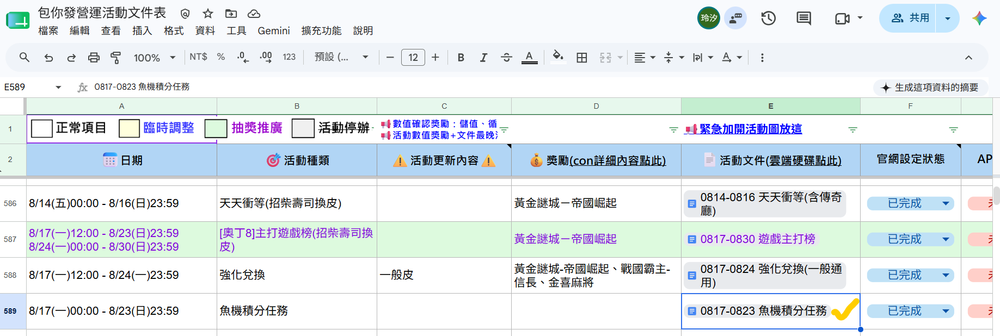

 甘特圖轉換工具 

> 版本：v1.0　撰寫日期：2026-08-17　BY yayihuang-bit
> ⚠️ 版本、撰寫日期、BY 都需要手動填寫更新

## 說明

新增維護[營運活動列表]({{ links.campaign_doc_sheet }})項目時，工具會自動將「[營運排程甘特圖](https://docs.google.com/spreadsheets/d/1B9F0DOBFTuBSmCbz3zaJ5ksPCbh6PJNAPoh-jsonVyQ/edit?gid=101789500#gid=101789500)」的內容轉換為[純時間格式的時間表](https://docs.google.com/spreadsheets/d/1B9F0DOBFTuBSmCbz3zaJ5ksPCbh6PJNAPoh-jsonVyQ/edit?gid=1338777900#gid=1338777900)。

原有甘特圖仍會保留，不會被取代；此功能僅是額外產出一份時間表，方便後續使用。

整體轉換流程為自動執行，無須人工處理，本段僅用於說明工具的運作邏輯。

來源（甘特圖）：

.png)

產出（純時程表）：

.png)

## 工具邏輯

實際轉換邏輯是用 GS（Google Apps Script）寫的，[轉換腳本](https://docs.google.com/spreadsheets/d/1B9F0DOBFTuBSmCbz3zaJ5ksPCbh6PJNAPoh-jsonVyQ/edit?gid=1831121228#gid=1831121228)放在這份試算表裡。

轉換出來的時間，會依照[活動參照表](https://docs.google.com/spreadsheets/d/1B9F0DOBFTuBSmCbz3zaJ5ksPCbh6PJNAPoh-jsonVyQ/edit?gid=1728849727#gid=1728849727)的預設時間去轉換。

轉換完的結果，要貼到[營運文件排程表]({{ links.campaign_doc_sheet }})。

