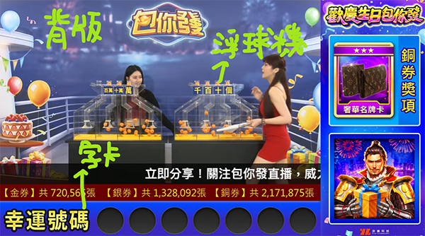
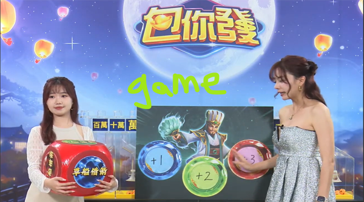
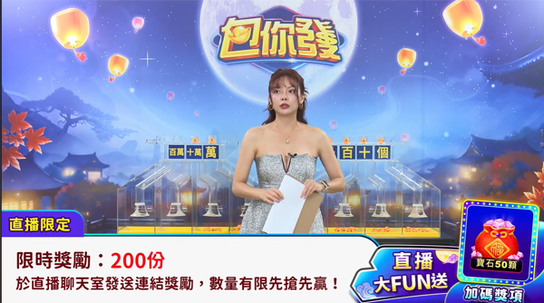
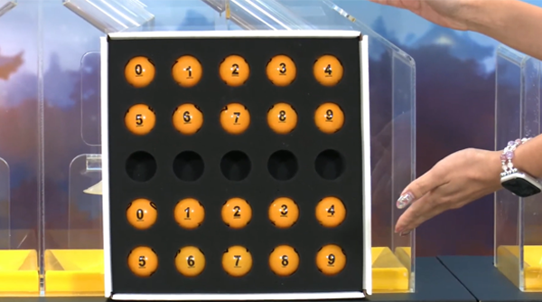

[← 返回抽獎](/sop-docs/抽獎_索引/)

---

 直播流程 

> 版本：v1.0　撰寫日期：2026-06-26　BY yayihuang-bit

## 執行流程

1. 抽獎活動結束前 1 個月，開始安排小遊戲、直播腳本

2. 小遊戲初版完成後，與行銷討論

3. 討論後與數學窗口說明，確認可出數值的時間

4. 完成後填寫[直播小遊戲需求](https://docs.google.com/spreadsheets/d/1LYcw13Xo17py_ZfnE9JuFHvDBmRvmnEdNXW32S0mq3g/edit?gid=217238638#gid=217238638)

5. 製作[直播腳本](https://drive.google.com/drive/folders/1J1ZmEwTveiqIuyJdOc2OQtNZNDY9yVT0)，確定可協助的企劃人員（一般為 4 位：小遊戲區 2 位／抽獎區 2 位）

6. 行銷將小遊戲輸出品提供給企劃，企劃做二次加工（主要請白白處理）

    ※ 加工注意事項：例如貼紙類只需要剪掉周圍四個角，讓它可黏貼就好，不用完全黏死，主持人比較好撕掉

7. 直播前三天，在官網、APP 內設定抽獎券直播公告（設定詳細請看抽獎券的文件），並設定推播，於直播當天 18:58 發送通知

## 直播小遊戲

> 玩法可參考[直播小遊戲需求](https://docs.google.com/spreadsheets/d/1LYcw13Xo17py_ZfnE9JuFHvDBmRvmnEdNXW32S0mq3g/edit?gid=217238638#gid=217238638)

目前固定 3 個：

- 2 個：以當期推廣的遊戲做玩法發想
- 1 個：固定是連結獎勵

## 行銷美術製作順序

> 專屬 Slack 群：[直播美術群組](https://yiletechnology.slack.com/archives/C08U66SKFB2)

1. 直播背景（通常有多版本，可同步到企劃區投票）

2. 行美確認回饋後，依投票結果更新直播背景

3. 小遊戲圖面＋直播字卡

## 直播當日

- 活動流程可參考[簡報](https://docs.google.com/presentation/d/1sqSnzG7iTMN_nPPbUYmIQcwu0zNHJ3Xa0IZYlw4TXqc/edit?slide=id.g33c2bb749f1_0_202#slide=id.g33c2bb749f1_0_202)
- 過往[直播參考](https://www.youtube.com/@online808/streams)（現在 YT 跟 FB 都有，主要在 FB）
- 通常在直播前，行銷會將腳本重新統合後影印出紙本，發給相關人員
- 直播有個 LINE 群，會通知對腳本、吃飯的時間；跟主持人對腳本只有主負責的企劃需要參與

## 注意事項

1. 直播用的企劃平板／筆電，需要記得充電

2. 記得帶小遊戲道具，並清點是否有遺漏

3. 直播的浮球機有球，需要到吧台拿餅乾盒子來裝

4. 浮球機的球會先依實際抽獎券券數安排好（0～9），百萬位的是獨立一盒（0～1），並貼上金銀銅的便利貼註解

    
