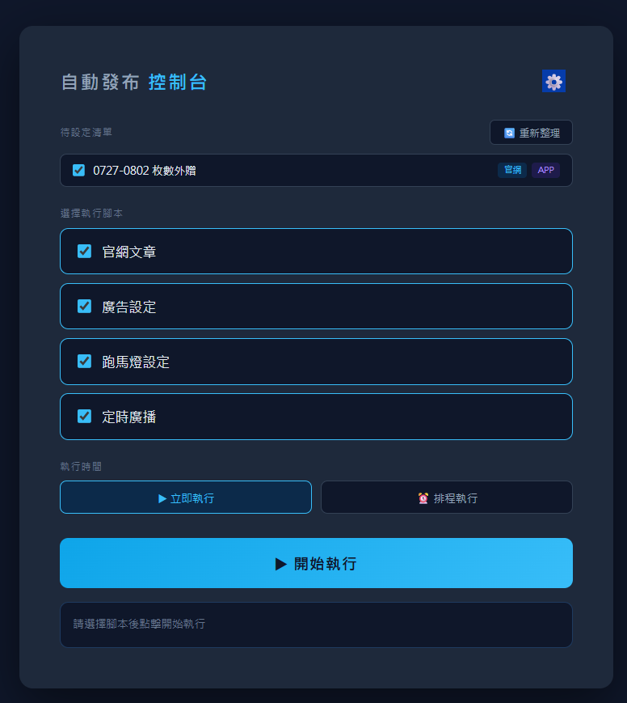
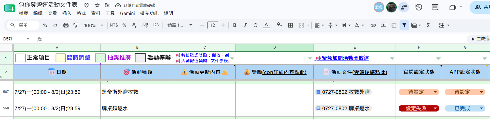

# 競品活動分析系統 — 使用指南🌝

> 版本：v1.0　撰寫日期：2026-05-26 , BY 呱呱🦆

---

## 📋 目錄

- [🏃 快速入門](#🏃快速入門)
- [1. 開啟系統](#1-開啟系統)
- [2. 資料來源說明](#2-資料來源說明)
- [3. 頁面配置](#3-頁面配置)
- [4. 功能頁籤說明](#4-功能頁籤說明)
  - [4.1 競品時間軸](#41-競品時間軸星城--滿貫大亨--金好運--等各競品)
  - [4.2 跨產品搜尋](#42-跨產品搜尋)
  - [4.3 活動類型總表](#43-活動類型總表)
  - [4.4 營收分析](#44-營收分析)
  - [4.5 數學資料庫](#45-數學資料庫)
  - [4.6 行銷資料庫](#46-行銷資料庫)
  - [4.7 其他資料](#47-其他資料)
- [5. 簡報範本系統](#5-簡報範本系統)
  - [5.1 簡報範本是什麼？](#51-簡報範本是什麼)
  - [5.2 三種簡報範本](#52-三種簡報範本)
  - [5.3 自動生成邏輯](#53-自動生成邏輯)
  - [5.4 表格填寫規則](#54-表格填寫規則)
  - [5.5 簡報範本插入工具](#55-簡報範本插入工具)
- [6. 新增競品](#6-新增競品)
  - [6.1 時間軸（活動快取）](#61-時間軸活動快取)
  - [6.2 開放使用者權限](#62-開放使用者權限)
- [7. 常見問題](#7-常見問題)
- [📝 修訂紀錄](#修訂紀錄)

---

## 🏃快速入門

### 這個系統是什麼？

一個**網頁儀表板**，讓你不用打開試算表或翻簡報，就能快速查看台灣手機遊戲（老虎機／麻將類）競品的活動時間軸、行銷策略、遊戲規格與 App 營收趨勢。

### 系統架構總覽

```
📊 簡報來源           →    🌐 競品分析系統                        ↕    📋 簡報工具
─────────────────          ─────────────────────────────────          ──────────────────
企劃季度簡報               競品時間軸  ｜  行銷資料庫                   自動生成季度簡報
行銷季度簡報               數學資料庫  ｜  跨產品搜尋                   範本插入工具
數學季度簡報               活動類型總表｜  📡 營收分析
                           其他資料（全寬）

━━━━━━━━━━━━━━━━━━━━━━━━━━━━━━ 後端支援基礎 ━━━━━━━━━━━━━━━━━━━━━━━━━━━━━━━━━━━━━
⚙️ 自動刷新時間軸  →  🗄️ Google Sheets  →  ↑ 供競品分析系統讀取  │  📡 SensorTower API  │  🔐 權限管控
GAS 定時觸發器         主試算表                （快取讀取）          │  即時營收＋下載量      │  Google Sheets
掃描簡報→寫入快取       快取儲存＋資料庫                              │  後端代理查詢         │  權限管理工作表
```

---

### 資料從哪裡來？

系統有兩條資料來源，運作方式不同：

| 來源 | 是什麼 | 怎麼更新 |
|------|--------|---------|
| Google Slides 季報 | 企劃、行銷、數學部門各自把競品資料填入簡報 | 需要管理員手動執行「快取更新」 |
| SensorTower API | 競品 App 在台灣的每日營收與下載量 | 每次查詢時即時抓取，無需更新 |

---

### 整體運作流程

```
【各部門人員】
  填寫競品資料
  → 企劃時間軸 / 行銷活動 / 數學遊戲規格
  → 存入 Google Slides（各競品季度簡報）
           │
           ▼
【管理員】執行「快取更新」
  （Google Sheets 選單 → 資料管理 → 更新活動快取）
  → 系統自動掃描 Slides，解析表格內容
  → 寫入 Google Sheets 快取
           │
           ▼
【所有使用者】開啟系統網址
  → 系統從快取讀取資料，渲染各頁籤
  → 可篩選日期、關鍵字、競品，或匯出報表

                     ┌─────────────────────────┐
                     │  SensorTower API（即時）  │
                     │  → 營收分析頁籤           │
                     │  每次查詢直接呼叫，        │
                     │  不需要快取更新            │
                     └─────────────────────────┘
```

---

### 哪些功能對我有用？

| 我想做的事 | 去哪個頁籤 |
|-----------|-----------|
| 看某競品這幾個月辦了哪些活動 | 各競品時間軸（頁籤列選競品名稱） |
| 同時比較多家競品的活動規律 | 跨產品搜尋 |
| 看各競品有哪些遊戲項目分類 | 活動類型總表 |
| 看競品的行銷活動（TVC、抽獎券等） | 行銷資料庫 |
| 查競品老虎機遊戲的玩法規格 | 數學資料庫 |
| 查競品 App 每日營收、下載量 | 營收分析 |

> ⚠️ 看不到某個頁籤？表示你的帳號沒有該頁籤的權限，請聯繫管理員。

---
# 導覽結束
## 1. 開啟系統

在瀏覽器輸入系統網址，需使用公司 Google 帳號登入。

**系統需求**：建議使用 Chrome 或 Edge，螢幕寬度 1280px 以上效果最佳，手機也可使用。

---

## 3. 頁面配置


頁籤列可點選「右上角箭頭收合」按鈕隱藏，讓內容區有更多空間。

---

## 4. 功能頁籤說明

### 4.1 競品時間軸（星城 / 滿貫大亨 / 金好運 … 等各競品）


**💡 功能**：以月曆甘特圖顯示該競品每個月的活動分布，按活動類型分列（老虎機新遊戲、魚機活動、抽獎活動等）。

**操作步驟**：

1. 點選頂部競品名稱頁籤
2. 設定**日期範圍**（年月選擇器），預設顯示最近資料
3. 選擇**時間粒度**：月份（預設）或年份
4. 輸入**關鍵字**搜尋特定活動名稱，多個關鍵字用逗號或空格分隔（OR 邏輯）
5. 點選「搜尋」，符合的活動會高亮並自動捲動至第一筆

---

### **【圖表說明】**：


- 上方橫條圖：各月份各活動類型的數量分布
- 下方時間軸：月曆格式，每格代表一天，活動橫條代表持續時間
- 活動橫條顏色代表活動類型，可在統計表中查看圖例
---

### **【匯出資料】**：


- 「匯出統計圖表」：輸出統計圖 + 活動明細清單（.xlsx + .png）
- 「匯出時間軸」：輸出時間軸截圖 + 活動日期清單（.xlsx + .png）

---

### **【統計表】**：

顯示目前篩選區間內，各活動類型的活動總數量。

| 欄位 | 說明 |
|------|------|
| 統計區間 | 目前顯示的起訖年月（隨日期篩選條件連動更新） |
| 活動類型 | 各活動分類名稱，顏色與時間軸橫條一致（可作為圖例對照） |
| 數量 | 該類型在篩選區間內的活動總筆數 |

> ⚠️ 切換時間粒度（月 / 年）或更改日期範圍時，統計表會同步更新。

---

### 4.2 跨產品搜尋


**💡 功能**：同時搜尋所有競品的活動，適合找特定活動類型在多家競品中的出現規律。

**操作步驟**：

1. 在搜尋框輸入關鍵字（如「抽獎」、「新遊戲」）
2. （選用）從「活動類型」標籤點選篩選特定類型
3. （選用）從「競品篩選」下拉選單指定查看哪些競品
4. 點選「搜尋」

---

### **【顯示模式】**：

| 模式 | 說明 |
|------|------|
| 依產品分組 | 各競品的搜尋結果分開顯示，可個別展開/收合 |
| 依時間排序 | 所有競品的符合活動混合按月份排序，方便看同期哪些競品有相同活動 |

---

### **【統計圖】**：
- 搜尋結果下方會顯示各競品在篩選區間內的活動趨勢折線圖。

---

### **【匯出】**：
- 點選「匯出 Excel」可下載搜尋結果表格與截圖。

---

### 4.3 活動類型總表


**💡 功能**：查看各競品的特定遊戲項目（老虎機機台、魚機機台等）分類整理，每項目附有連結可直接開啟對應簡報。

**操作步驟**：

1. 在「競品篩選」下拉選單勾選要查看的競品（預設全選）
2. 在關鍵字欄位輸入項目名稱（有 1 秒 debounce）
3. 點選各卡片可展開查看詳細清單

---
### 4.4 營收分析


**💡 功能**：從 SensorTower 即時取得競品 App 在台灣市場的每日營收（美元）與下載量，並以圖表顯示趨勢。

**操作步驟**：

1. 設定**查詢日期範圍**（起始日期～結束日期）
2. 在「選擇競品」下拉勾選要分析的 App（可多選，預設勾選星城、金好運）
3. 點選「查詢數據」，系統呼叫 SensorTower API 取得資料
4. 選擇**時間粒度**：日 / 週 / 月 / 年

---

### **【圖表說明】**：

- **營收趨勢圖**：各競品每日/週/月/年營收（USD）折線圖
- **下載量趨勢圖**：各競品下載次數折線圖
- **年度同期比較**：展開「進階 YoY 分析」，將同一競品不同年份的資料對齊比較

---

### **【頂部統計卡】**：

| 卡片 | 說明 |
|------|------|
| 總營收 | 查詢期間所有選中競品的合計 |
| 日均營收 | 總營收 ÷ 天數 |
| 單日最高 | 期間內最高單日營收及日期 |

> ⚠️ 查詢範圍越大、競品越多，API 回應時間越長（通常 5~15 秒）。

---
### 4.5 數學資料庫


**💡 功能**：查看各競品老虎機遊戲的整體規格，包含玩法類型、盤面大小、特色購買、參考遊戲等。

**操作步驟**：

1. 從「競品」下拉選擇競品（可多選）
2. 從「玩法類型」選擇特定玩法（如 Way Game、Cluster、Line 等）
3. 設定「上架日期範圍」（年月格式）
4. 輸入關鍵字搜尋遊戲名稱
5. 點選遊戲卡片展開詳細規格（展開後再點一次收合）

---

### **【圖表視圖切換】**（卡片列表上方）：


| 視圖 | 說明 |
|------|------|
| 按月趨勢 | 各月上架遊戲數量折線圖 |
| 年度趨勢 | 各年上架數量折線圖 |
| 競品分布 | 各競品上架遊戲數量比較 |
| 玩法分布 | 各玩法類型使用頻率 |

---
### 4.6 行銷資料庫


**💡 功能**：以甘特圖顯示各競品的行銷活動（TVC、抽獎券活動、社群貼文、合作推廣等）。

**操作步驟**：

1. 在「競品」下拉勾選要查看的競品
2. 設定月份範圍（年月選擇器）
3. 輸入關鍵字篩選活動名稱

---

### **【視角切換】**：

| 模式 | 說明 |
|------|------|
| 依月份 | 所有競品混合，按月份顯示甘特圖，適合橫向比較同一時期的行銷力度 |
| 依競品 | 各競品獨立區塊，適合縱向追蹤單一競品的行銷策略變化 |

---

### **【統計圖】**：
- 下方圖表可切換為長條圖或折線圖，X 軸為月份，系列為行銷分類。

---
### 4.7 其他資料


**💡 功能**：提供兩個連結清單的快捷入口。

**資料來源**：[競品追蹤 Google Sheets](https://docs.google.com/spreadsheets/d/1TD-uKw3pz9ax7CW2WgtS8z4xfal-kCODliT4PU2CqoI/edit?gid=796982050) →「目錄」工作表（需手動維護）


| 區域 | 對應欄位標題 | 說明 |
|------|-------------|------|
| 其他項目連結 | `其他項目連結🎃(需手動更新)` | 各類參考資料連結 |
| 營運正式簡報 | `營運正式簡報連結(需手動更新)🎃` | 按年份分組的雙週報連結 |

> ⚠️ 新增或修改連結請直接編輯「目錄」工作表對應欄位，重新整理頁面後即生效。

點選連結後：
- Google Docs 類型 → 在頁面內以 Overlay 視窗預覽，按 ESC 或右上角 ✕ 關閉
- Google Drive 資料夾 → 開新分頁
- 其他連結 → 開新分頁

---

## 5. 簡報範本系統

> ⚠️ 本節說明的範本生成工具與競品分析系統**完全獨立**，兩套系統不共用資料，互不影響。

---

### 5.1 簡報範本是什麼？

各部門每隔固定週期需要填寫一份**競品營運簡報**，記錄當期各競品的活動、行銷、數學遊戲規格等資料。這些簡報：

1. 由腳本**自動從固定範本複製出新的一份**，存到 Google Drive 指定資料夾
2. 部門人員開啟後**手動填入當期競品資料**
3. 管理員執行「快取更新」後，系統掃描這些簡報，把資料同步到競品分析系統

---

### 5.2 三種簡報範本

| 種類 | 負責部門 | 生成頻率 | Drive 資料夾 |
|------|---------|---------|------------|
| **企劃** | 企劃部門 | 每月 1 日 | [企劃簡報資料夾](https://drive.google.com/drive/folders/1GvBQfZ4651DTJn3WOcP6DQZWf0dbMbqn) |
| **行銷** | 行銷部門 | 每月 1 日 | [行銷簡報資料夾](https://drive.google.com/drive/folders/1YnmltpcksZXL5NsMa0gBY65zkN_M8s33) |
| **數學** | 數學部門 | 每 28 天 | [數學簡報資料夾](https://drive.google.com/drive/folders/1hzm_M_LelaC2DpDZ98784vppfqIQyD73) |

生成後的簡報存放路徑格式：

```
{部門資料夾}/
  └── {年份}/
        └── {MMdd}/              ← 日期資料夾，如 0601
              └── 0601營運簡報   ← 複製自範本的簡報
```

---

### 5.3 自動生成邏輯

腳本執行時會：

1. 掃描 Drive 資料夾，找出**最新已存在的日期**
2. 計算下一個應生成的日期（企劃/行銷：下個月1日；數學：+28天）
3. 若今天日期 < 預計生成日期 → 停止，不提前建立
4. 若目標日期資料夾已存在 → 跳過，避免重複
5. 複製範本簡報，**自動刪除**投影片左側標有「**範本**」標籤的頁面（空白的示意頁）
6. 修改封面標題，加上日期前綴（如 `0601營運簡報`）

> 💡 三支腳本均已在 GAS 設定**每日觸發器**，每天自動執行一次。腳本執行時會自行判斷今天日期是否達到生成週期，符合才複製新簡報，否則直接結束。若某期沒有生成，請到 GAS 確認觸發器是否正常運作。

---

### 5.4 表格填寫規則

填好的簡報會被快取更新腳本掃描，因此**表格格式需嚴格遵守**，否則系統無法正確解析。

#### 企劃時間軸表格

每張時間軸投影片必須有對應標題（如「星城時間軸」），表格格式如下：

```
┌──────────┬──────────┬──────────────────────────────────────────┐
│（標題列） │          │                                          │
├──────────┼──────────┼──────────────────────────────────────────┤
│          │ 活動類型 │ 活動名稱(MM/DD~MM/DD)                     │
│          │          │ 活動名稱(MM/DD~MM/DD)   ← 同一列可多行   │
│          │ 新類型   │ 活動名稱(MM/DD)          ← 無結束日視同單日│
└──────────┴──────────┴──────────────────────────────────────────┘
  A 欄（略）  B 欄         C 欄
```

| 欄位 | 規則 |
|------|------|
| **B 欄（活動類型）** | 填活動種類（如：老虎機新遊戲、抽獎活動）；空白時自動沿用上一列的類型 |
| **C 欄（活動內容）** | 每行一筆活動，格式：`活動名稱(開始日~結束日)`；可用前綴標籤：`[排行榜] 活動名稱(日期)` |

**日期格式範例**：

| 格式 | 說明 |
|------|------|
| `活動名稱(12/1~12/31)` | 一般活動 |
| `活動名稱(12/28~1/5)` | 跨年（自動偵測，結束月 < 開始月 → 跨年） |
| `活動名稱(2025/11/25~2025/12/31)` | 明確指定年份 |
| `活動名稱(3/15)` | 單日活動（無結束日） |

> ⚠️ C 欄填 `-` 的那行會被略過。某列 B 欄為空則沿用上一列類型。

---

#### 行銷時間軸表格

每張時間軸投影片必須有對應標題（如「星城行銷時間軸」），欄位結構與企劃相同，但**日期必須包含年份**：

```
┌──────────┬──────────┬──────────────────────────────────────────────────┐
│（標題列） │          │                                                  │
├──────────┼──────────┼──────────────────────────────────────────────────┤
│          │ 活動類型 │ 活動名稱(YYYY/MM/DD~YYYY/MM/DD)                   │
│          │ 新類型   │ 活動名稱(YYYY/MM/DD)     ← 單日活動               │
└──────────┴──────────┴──────────────────────────────────────────────────┘
  A 欄（略）  B 欄         C 欄
```

> ⚠️ 行銷日期**必須填寫完整年份**（如 `2025/06/01~2025/06/30`），不可省略年份，否則系統無法正確解析。

---

#### 數學時間軸表格

標題需包含「**XX數學時間軸**」，表格為**直式鍵值對**：

| 標籤（A 欄） | 值（B 欄） | 說明 |
|------------|----------|------|
| 名稱 | `遊戲名稱(YYYY/MM/DD)` | 括號內為上架日期，格式固定 |
| 玩法分類 | `[Way Game][百搭]` | 方括號標記，可多個 |
| 玩法簡述 | 文字說明 | |
| 美術簡述 | 文字說明 | |
| 盤面大小 | 如 `5x5` | |
| 有參考遊戲 | 遊戲名稱或「無」 | |
| 特色購買 | 有 / 無 | |
| Extra Bet | 有 / 無 | |

> ⚠️ 「名稱」列必填且格式要正確，解析失敗的表格整筆略過不寫入快取。

---

### 5.5 簡報範本插入工具

這是一個獨立掛在 Google Slides 上的工具，讓你在製作自己的簡報時，可以快速插入公司預先做好的範本投影片，不用手動複製。


#### 快速入門

1. 在 Google Slides 選單點選 **⭐開啟範本工具⭐ → 顯示範本選單**
2. 在簡報中**點選一張投影片**（作為插入位置）
3. 從右側側邊欄選取細項，**點一下**即插入到選取頁後方

找不到範本？在側邊欄頂部搜尋框輸入關鍵字即可篩選。

---

#### 側邊欄功能

**瀏覽範本**

範本依三層結構折疊顯示：

```
主項（如：提案、行銷、企劃）
  └─ 子項
       └─ 細項 ← 點擊即插入
```

**搜尋**：頂部搜尋框即時過濾，關鍵字以黃底標記。

**開啟原始範本**：右上角按鈕，在新分頁開啟範本庫 Google Slides。

**深 / 淺色主題**：右上角 🌙 / ☀️ 切換，記憶到帳號（跨裝置同步）。

**自動更新**：側邊欄每 30 秒偵測範本庫是否有變更，有變更則自動重新掃描，無需手動重整。

---

#### 管理員：新增 / 修改範本

**範本來源說明**

所有範本統一存放於**企劃簡報範本**（Google Slides），這份簡報同時服務兩個用途：

| 工具 | 如何使用企劃簡報範本 |
|------|-------------------|
| 範本插入工具（本工具） | 讀取其中的投影片供使用者選擇插入 |
| 企劃簡報自動生成腳本 | 每月複製整份簡報作為新一期的營運簡報底稿 |

> ⚠️ 企劃簡報範本本身附有製作說明，新增範本前建議先閱讀。

---

**範本製作流程**

1. 在其他地方做好要作為範本的投影片（可多張）
2. 在**第一張**投影片的左側邊緣（距左邊 < 100px）放一個文字框，填入分類標記：
   
   ```
   主項：XXX
   子項：XXX
   細項：XXX
   ```
3. 把做好的投影片（含標記頁）**複製貼入企劃簡報範本**
4. 儲存後，側邊欄 30 秒內自動偵測並更新，**無需重新部署**

> ⚠️ 標記文字框若距左邊 ≥ 100px，系統無法識別為標記，投影片會被歸入前一個細項。

---

## 6. 新增競品

以下三個部分各自獨立，依實際需求選擇要設定哪些：

---

### 6.1 時間軸（活動快取）
  
**圖以行銷部門要增加競品範本作舉例**

以行銷新增「星城」為例，企劃、數學的操作邏輯相同：

1. 在對應部門的 Slides 中，找到任一競品的「**XX行銷時間軸**」頁面，複製一份
2. 把標題從「XX行銷時間軸」改成「**星城行銷時間軸**」
3. 下次執行快取更新時，系統會自動掃描到這個頁面並建立星城的資料

> ⚠️ 表格結構本身不能改動，只改標題名稱即可。若需新增活動種類，需聯繫管理員修改程式碼（見常見問題）。

---

### 6.2 開放使用者權限

在 [權限管理工作表](https://docs.google.com/spreadsheets/d/1TD-uKw3pz9ax7CW2WgtS8z4xfal-kCODliT4PU2CqoI) 的對應 Email 欄位，加入新競品名稱（與資料夾名稱一致）。

---

## 7. 常見問題

### Q: 頁籤看不到某些競品或功能？

你的帳號可能沒有該頁籤的存取權限。請聯繫系統管理員確認帳號設定。

### Q: 競品時間軸資料不是最新的？

快取需手動更新，若最近有新的季度簡報，請通知管理員執行更新。

### Q: 營收分析查詢很慢或無回應？

查詢日期範圍越長、競品越多，SensorTower API 回應時間越久。建議先用較短的日期範圍（如一個月）測試，確認正常後再擴大範圍。
若完全失效可能是短時間大量使用API，導致Sensor啟用保護機制，導致API失效，請通知管理員執行更新。

### Q: 搜尋關鍵字如何使用？

各頁籤的邏輯不同：

| 頁籤 | 分隔符 | 多關鍵字邏輯 | 比對欄位 |
|------|--------|------------|---------|
| 競品時間軸 | 逗號或空格 | **OR**（任一符合即顯示） | 活動名稱、活動類型、原始內容 |
| 跨產品搜尋 | 逗號或空格 | **OR**（任一符合即顯示） | 活動名稱、活動類型、原始內容 |
| 行銷資料庫 | 逗號（不支援空格） | **OR**（任一符合即顯示） | 活動名稱、分類、競品 |
| 數學資料庫 | 逗號（不支援空格） | **AND**（全部關鍵字都要符合） | 競品、遊戲名稱、玩法類型、盤面大小、參考遊戲 |

所有頁籤均不區分大小寫。

### Q: 資料內容為什麼是錯誤的？

資料錯誤通常有兩種情形：

- **活動類型標籤錯誤**：某個活動被歸類到錯誤的類型（如應該是「抽獎活動」卻顯示為「老虎機新遊戲」）
- **競品資料串位**：A 競品的活動出現在 B 競品的頁籤下

這兩種情形的根源幾乎都是**原始 Google Slides 簡報內的表格填寫有誤**（類型欄填錯、貼到錯誤競品的簡報等）。請開啟對應競品的來源簡報確認表格內容，修正後通知管理員重新執行快取更新即可。

---

### Q: 某個競品的時間軸資料太多，同一頁放不下，可以拆開嗎？
 

可以。直接把表格內容拆到多張投影片，每張都保留「**XX時間軸**」的標題，系統掃描時會自動把所有同名時間軸的資料合併起來。

例如「星城行銷時間軸」拆成三頁，三頁的標題都叫「星城行銷時間軸」，掃描後星城的行銷資料就會包含三頁的內容。

---

### Q: 想新增一個新的活動種類（例如新的行銷類型、老虎機分類），該怎麼做？


活動種類是**程式碼寫死**的，不是從簡報自動讀取，所以就算在簡報表格中新增了一列新類型，系統也無法自動辨識。

需要聯繫管理員修改程式碼，新增對應的分類定義後重新部署，系統才會正確識別並顯示新種類。

---

### Q: 匯出的 Excel 無法開啟？

系統使用 SheetJS 在瀏覽器端產生 .xlsx，若下載後無法開啟，請嘗試以 LibreOffice 或 Google Sheets 開啟。


---

## 📝 修訂紀錄

> ⚠️ **維護提醒：** 每次修改 `使用指南.md` 確認完畢後，須同步轉換為 `使用指南.html`。

> 🖼️ **更新圖片／影片：** 請聯繫管理員協助更換，管理員會重新嵌入並輸出 `使用指南.html`。

| 版本 | 日期 | 執行人 | 修訂內容 |
|------|------|--------|---------|
| v1.0 | 2026-05-28 | 呱呱 | 正式發布，含完整功能頁籤說明、快取更新、權限說明、新增競品、簡報範本系統、架構總覽圖、側邊欄 Scroll Spy |
