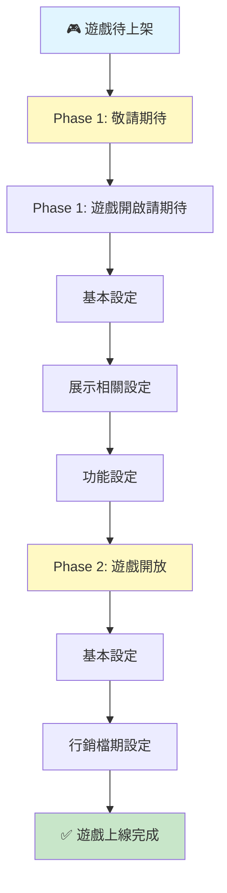

 **🎮 遊戲上線設定 流程 & 檢查清單** 

> 版本：v1.0　撰寫日期：2026-06-17　BY yayihuang-bit

## 📋 項目目的性

1. 統一遊戲從未上架到正式上線的設定流程
2. 避免漏項或重複設定
3. 清楚標示哪些項目需要確認或等待他人提供資訊

⚠️ **設定完成後請務必進行二次檢查，因設定後若有調整，可能導致顯示錯誤**

---

## 🔄 整體流程圖

---

---

##### **🟨【Phase 1: 遊戲開敬請期待】**

###### **📄【基本設定 - 必填】**

─────────────────────────────────────

**遊戲狀態設定**

- [ ] 進入後台 → 未上架遊戲

- [ ] 點選「操作」

- [ ] **遊戲狀態改為「敬請期待」**
- [ ] 填寫**敬請期待日期**

**地區限制**

- [ ] 確認是否需要限制地區
  - 是 → 設定限制地區
  - 否 → 跳過

---

###### **📄【展示相關設定】**

─────────────────────────────────────

**大廳顯示**

- [ ] **大廳同步顯示時間** → 確認時間設定
  - 是否顯示？
  - 可問 mini 確認

**遊戲標籤**

- [ ] 遊戲標籤：**無**

**圖示設定**

- [ ] **圖示種類彩金** → 🔴 **問數學確認**
- [ ] **圖示種類** → 🟡 **待確認**

**遊戲活動 Icon**

- [ ] **遊戲活動 icon** → 🟡 **待確認**
  - 注：高設定之類有額外外掛的圖

**介紹內容**

- [ ] **玩法介紹** → 使用遊戲新手教學用
- [ ] **介紹文章** → 放官網介紹
- [ ] **介紹圖片** → 🟡 **待確認**

**推薦資訊**

- [ ] **推薦遊戲資訊** → 參考 [官網遊戲說明](https://drive.google.com/drive/folders/13szAAYtRiiy77VlxkdRIfDBTMMnjxyKn) / [雙平台文案](https://docs.google.com/spreadsheets/d/1qmRZ-OT-PW6IzQFoJatZKf8fMUwnnBX-gyYHZCxuL1E/edit?gid=1369417998#gid=1369417998)

---

###### **📄【功能設定】**

─────────────────────────────────────

**遊戲方向**

- [ ] **是否直立式** → 看本身遊戲設定

**機台保留功能**

- [ ] **機台保留功能設定**
  - 限制：遊戲上線第一週，體驗廳不能進行保留
  - [ ] 確認是否為上線第一週
  - [ ] 若否 → 開放保留

**預約功能**

- [ ] **預約關閉機台保留功能** → 🟡 **運用狀態待確認**
  - 注：為了避免誤觸，要摺疊起來

**金幣相關**

- [ ] **金幣 VIP 層級** → 看 Help 確認
- [ ] **金幣管玩家等級** → 🟡 **使用狀態待確認**

---

###### **📄【Phase 1 待確認項目】**

─────────────────────────────────────

| 項目 | 負責人 | 備註 | 狀態 |
|------|--------|------|------|
| 圖示種類彩金 | 數學 | 需確認金幣種類 | ⏳ |
| 圖示種類 | - | 需確認 | ⏳ |
| 遊戲活動 icon | - | 有外掛圖設定 | ⏳ |
| 遊戲必填 | - | 狀態待確認 | ⏳ |
| 介紹圖片 | - | 待確認 | ⏳ |
| 預約關閉機台保留功能運用 | - | 待確認 | ⏳ |
| 金幣管玩家等級使用狀態 | - | 待確認 | ⏳ |

---

---

##### **🟩【Phase 2: 遊戲開放】**

###### **📄【基本設定 - 必填】**

─────────────────────────────────────

**遊戲狀態改為開放**

- [ ] 進入後台 → 已上架遊戲（或敬請期待遊戲）
- [ ] 點選「操作」
- [ ] **遊戲狀態改為「開放」**
- [ ] 確認開放日期

**地區設定確認**

- [ ] 確認地區限制是否需要調整
  - 是 → 更新限制地區
  - 否 → 保持現狀

---

###### **📄【展示相關確認】**

─────────────────────────────────────

**大廳顯示確認**

- [ ] **大廳同步顯示時間** → 最終確認是否顯示
- [ ] **預告倒數計時** → 移除或更新

**圖示 & 標籤最終確認**

- [ ] **圖示種類彩金** → 最終確認
- [ ] **圖示種類** → 最終確認
- [ ] **遊戲活動 icon** → 最終確認
- [ ] **遊戲標籤** → 確認是否調整

**介紹內容最終版**

- [ ] **玩法介紹** → 確認無誤
- [ ] **介紹文章** → 確認官網連結正確
- [ ] **介紹圖片** → 最終確認
- [ ] **推薦遊戲資訊** → 確認最新文案

---

###### **📄【功能確認】**

─────────────────────────────────────

**機台保留功能確認**

- [ ] **上線週期檢查**
  - 是否已過第一週？
  - 是 → 開放保留功能
  - 否 → 保持限制

**預約 & VIP 功能**

- [ ] **預約功能** → 確認摺疊狀態正確
- [ ] **金幣 VIP 層級** → 確認配置
- [ ] **金幣管玩家等級** → 確認運用狀態

---

###### **📄【發佈前檢查清單】**

─────────────────────────────────────

- [ ] 所有基本設定完成
- [ ] 所有展示內容確認無誤
- [ ] 所有功能測試完成
- [ ] 敬請期待期間反饋處理完畢
- [ ] App 版本相符
- [ ] 活躍度設定確認
- [ ] 榜訂條件設定確認

---

###### **📄【常見問題】**

─────────────────────────────────────

**Q: 敬請期待期間用戶會看到什麼？**

A: 用戶會看到遊戲的預告資訊、敬請期待倒計時、推薦資訊等，但無法進入遊戲。

**Q: 第一週機台保留功能是什麼？**

A: 遊戲上線的第一週，體驗廳用戶不能進行機台保留操作。

**Q: 圖示種類彩金要問誰？**

A: 問數學（見上方「待確認項目」表）

**Q: 何時從敬請期待改成開放？**

A: 等到敬請期待日期到期，或根據業務需求決定開放時間。

---

══════════════════════════════════════

**最後更新：** 2026-06-17  
**維護者：** [你的名字]

══════════════════════════════════════
