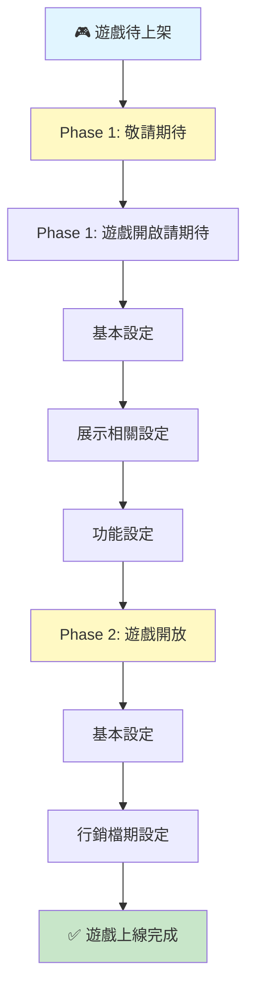
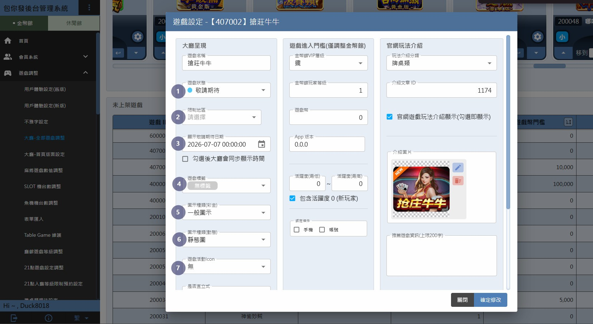


 遊戲上線設定 流程 & 檢查清單 

> 版本：v1.0　撰寫日期：2026-06-17　BY yayihuang-bit

## 🔄 整體流程圖

```mermaid
graph TD
    A["🎮 遊戲待上架"] --> B["Phase 1: 敬請期待"]
    B --> C["Phase 1: 遊戲開啟請期待"]
    C --> D["基本設定"]
    D --> E["展示相關設定"]
    E --> F["功能設定"]
    F --> G["Phase 2: 遊戲開放"]
    G --> H["基本設定"]
    H --> I["行銷檔期設定"]
    I --> J["✅ 遊戲上線完成"]
    
    style A fill:#e1f5ff
    style J fill:#c8e6c9
    style B fill:#fff9c4
    style G fill:#fff9c4
```

---

---

##### **🟨【Phase 1: 遊戲開敬請期待】**

###### **📄【遊戲設定視窗】**

─────────────────────────────────────

**開啟設定視窗**

1. 進入後台 → 未上架遊戲

2. 點選「操作」

**設定項目**（編號對應下圖標註）

<table style="width:100%; table-layout:fixed;">
<thead><tr>
<th style="width:6%">#</th>
<th style="width:26%">項目</th>
<th style="width:68%">說明</th>
</tr></thead>
<tbody>
<tr><td>1</td><td>遊戲狀態</td><td>改為「敬請期待」</td></tr>
<tr><td>2</td><td>限制地區</td><td>確認<a href="https://drive.google.com/drive/folders/13szAAYtRiiy77VlxkdRIfDBTMMnjxyKn" target="_blank">官網說明</a>內是否需要設定（授權作品、外部廠商授權的遊戲通常有區域限制）</td></tr>
<tr><td>3</td><td>顯示敬請期待日期</td><td>填寫日期；勾選後大廳會同步顯示時間（可問 mini 確認）</td></tr>
<tr><td>4</td><td>遊戲標籤</td><td>無</td></tr>
<tr><td>5</td><td>圖示種類（彩金）</td><td>🔴 問數學確認</td></tr>
<tr><td>6</td><td>圖示種類（動態）</td><td>🟡 待確認</td></tr>
<tr><td>7</td><td>遊戲活動 Icon</td><td>🟡 待確認（高設定之類有額外外掛的圖）</td></tr>
<tr><td>8</td><td>是否直立式</td><td>看本身遊戲設定</td></tr>
<tr><td>9</td><td>機台保留功能</td><td>遊戲上線第一週，體驗廳不能進行保留；已過第一週 → 開放保留</td></tr>
<tr><td>10</td><td>預約「開啟」機台保留功能</td><td>設定開啟時間與廳館</td></tr>
<tr><td>11</td><td>預約「關閉」機台保留功能</td><td>🟡 運用狀態待確認（為避免誤觸，要摺疊起來）</td></tr>
<tr><td>12</td><td>金幣館 VIP 層級</td><td>看 Help 確認；金幣管玩家等級 🟡 使用狀態待確認</td></tr>
<tr><td>13</td><td>官網玩法介紹</td><td>玩法介紹 → 使用遊戲新手教學用；介紹文章 → 放官網介紹；介紹圖片 🟡 待確認；推薦遊戲資訊參考 <a href="https://drive.google.com/drive/folders/13szAAYtRiiy77VlxkdRIfDBTMMnjxyKn" target="_blank">官網遊戲說明</a> / <a href="https://docs.google.com/spreadsheets/d/1qmRZ-OT-PW6IzQFoJatZKf8fMUwnnBX-gyYHZCxuL1E/edit?gid=1369417998#gid=1369417998" target="_blank">雙平台文案</a></td></tr>
</tbody>
</table>

---

###### **📄【Phase 1 待確認項目】**

─────────────────────────────────────

| 項目 | 負責人 | 備註 | 狀態 |
|------|--------|------|------|
| 圖示種類彩金 | 數學 | 需確認金幣種類 | ⏳ |
| 圖示種類 | - | 需確認 | ⏳ |
| 遊戲活動 icon | - | 有外掛圖設定 | ⏳ |
| 遊戲必填 | - | 狀態待確認 | ⏳ |
| 介紹圖片 | - | 待確認 | ⏳ |
| 預約關閉機台保留功能運用 | - | 待確認 | ⏳ |
| 金幣管玩家等級使用狀態 | - | 待確認 | ⏳ |

---

---

##### **🟩【Phase 2: 遊戲開放】**

###### **📄【基本設定 - 必填】**

─────────────────────────────────────

**遊戲狀態改為開放**

1. 進入後台 → 已上架遊戲（或敬請期待遊戲）
2. 點選「操作」
3. **遊戲狀態改為「開放」**
4. 確認開放日期

**地區設定確認**

1. 確認地區限制是否需要調整
  - 是 → 更新限制地區
  - 否 → 保持現狀

---

###### **📄【展示相關確認】**

─────────────────────────────────────

**大廳顯示確認**

1. **大廳同步顯示時間** → 最終確認是否顯示
2. **預告倒數計時** → 移除或更新

**圖示 & 標籤最終確認**

1. **圖示種類彩金** → 最終確認
2. **圖示種類** → 最終確認
3. **遊戲活動 icon** → 最終確認
4. **遊戲標籤** → 確認是否調整

**介紹內容最終版**

1. **玩法介紹** → 確認無誤
2. **介紹文章** → 確認官網連結正確
3. **介紹圖片** → 最終確認
4. **推薦遊戲資訊** → 確認最新文案

---

###### **📄【功能確認】**

─────────────────────────────────────

**機台保留功能確認**

1. **上線週期檢查**
  - 是否已過第一週？
  - 是 → 開放保留功能
  - 否 → 保持限制

**預約 & VIP 功能**

1. **預約功能** → 確認摺疊狀態正確
2. **金幣 VIP 層級** → 確認配置
3. **金幣管玩家等級** → 確認運用狀態

---

###### **📄【發佈前檢查清單】**

─────────────────────────────────────

1. 所有基本設定完成
2. 所有展示內容確認無誤
3. 所有功能測試完成
4. 敬請期待期間反饋處理完畢
5. App 版本相符
6. 活躍度設定確認
7. 榜訂條件設定確認

---

###### **📄【常見問題】**

─────────────────────────────────────

**Q: 敬請期待期間用戶會看到什麼？**

A: 用戶會看到遊戲的預告資訊、敬請期待倒計時、推薦資訊等，但無法進入遊戲。

**Q: 第一週機台保留功能是什麼？**

A: 遊戲上線的第一週，體驗廳用戶不能進行機台保留操作。

**Q: 圖示種類彩金要問誰？**

A: 問數學（見上方「待確認項目」表）

**Q: 何時從敬請期待改成開放？**

A: 等到敬請期待日期到期，或根據業務需求決定開放時間。

---

══════════════════════════════════════

**最後更新：** 2026-06-17  
**維護者：** [你的名字]

══════════════════════════════════════
