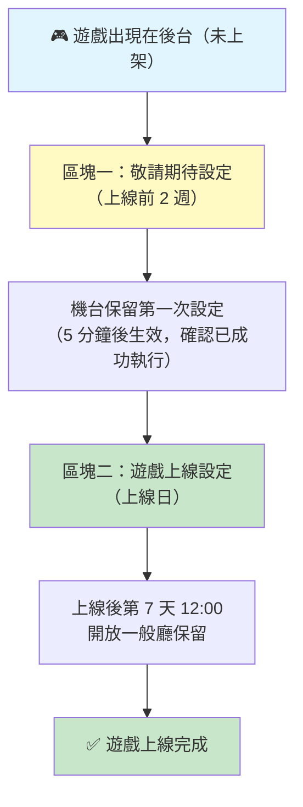
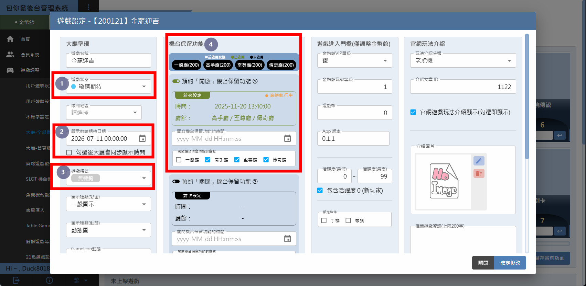

 遊戲上線設定 流程 & 檢查清單 

> 版本：v1.1　撰寫日期：2026-07-06　BY yayihuang-bit
> ⚠️ 版本、撰寫日期、BY 都需要手動填寫更新

## 🕐 時間軸總覽

以「7/9 上線」為例：

<table style="width:100%; table-layout:fixed;">
<thead><tr>
<th style="width:40%">時間</th>
<th style="width:60%">動作</th>
</tr></thead>
<tbody>
<tr><td class="wrap">上線前 2 週（6/25 12:00）</td><td class="wrap">設定敬請期待（見「區塊一」）</td></tr>
<tr><td class="wrap">敬請期待生效 5 分鐘後（6/25 12:05～12:10）</td><td class="wrap">第一次機台保留生效，確認顯示「已成功執行」（務必在上線前生效完畢）</td></tr>
<tr><td>上線日（7/9）</td><td class="wrap">遊戲上線設定（見「區塊二」）</td></tr>
<tr><td class="wrap">上線後第 7 天 12:00（7/16）</td><td class="wrap">第二次機台保留：開放一般廳～傳奇廳</td></tr>
</tbody>
</table>

> 所有時間都是由「上線日」推算：敬請期待 ＝ 上線日 −14 天；第二次保留 ＝ 上線日 ＋7 天 12:00

## 🔄 整體流程圖

```mermaid
graph TD
    A["🎮 遊戲出現在後台（未上架）"] --> B["區塊一：敬請期待設定<br>（上線前 2 週）"]
    B --> C["機台保留第一次設定<br>（5 分鐘後生效，確認已成功執行）"]
    C --> D["區塊二：遊戲上線設定<br>（上線日）"]
    D --> E["上線後第 7 天 12:00<br>開放一般廳保留"]
    E --> F["✅ 遊戲上線完成"]

    style A fill:#e1f5ff
    style B fill:#fff9c4
    style D fill:#c8e6c9
    style F fill:#c8e6c9
```

---

## 🟨 區塊一：敬請期待設定（上線前 2 週）

**開啟設定視窗**：進入後台 → 未上架遊戲 → 點選「操作」

這個階段要設定的項目（編號對應下圖標註）：

1. **遊戲狀態** → 改為「敬請期待」
2. **顯示敬請期待日期** → 遊戲開放前兩週；「勾選後大廳會同步顯示時間」要跟 mini 確認
3. **遊戲標籤** → 無標籤
4. **機台保留功能** → 依下方「機台保留規則」設定

其他欄位都在上線日才設定（見「區塊二」）。

### 機台保留規則（需分兩次設定）

**第一次設定**

- 預約「開啟」機台保留功能：高手廳／至尊廳／傳奇廳
- 觸發時間：敬請期待上線後的 5 分鐘
- 設定後等待生效，重新開啟該設定視窗，確認設定顯示「**已成功執行**」

**第二次設定**（第一次生效後才能設定）

- 預約「開啟」機台保留功能：一般廳～傳奇廳
- 觸發時間：遊戲上線後第 7 天的 12:00
- 原因：一般廳上線後第一週不能保留，第 7 天才開放

---

## 🟩 區塊二：遊戲上線設定（上線日）

<table style="width:100%; table-layout:fixed;">
<thead><tr>
<th style="width:18%">項目</th>
<th style="width:82%">說明</th>
</tr></thead>
<tbody>
<tr><td>遊戲狀態</td><td>改為「開啟」</td></tr>
<tr><td>限制地區</td><td class="wrap">看<a href="{{ links.game_website_info_folder }}" target="_blank">官網 INFO</a>，通常是外接或者 IP 授權的遊戲都有地區限制</td></tr>
<tr><td>遊戲標籤</td><td class="wrap">新上架（彩金類遊戲 → 無標籤）</td></tr>
<tr><td>彩金</td><td>🟡 文件之後補</td></tr>
<tr><td style="white-space:nowrap;">彩金 bank 動態</td><td class="wrap">現在預設都會動（不需要動的狀態 🟡 待確認）</td></tr>
<tr><td>GameIcon</td><td class="wrap">開啟（只有敬請期待階段不開）</td></tr>
<tr><td>爆發度、直橫設定</td><td class="wrap">查 <a href="{{ links.slot_game_list_doc }}" target="_blank">Slot Game List</a></td></tr>
<tr><td>遊戲進入門檻</td><td class="wrap">VIP 層級看官網 VIP 表格（有時不準確，要留意）；活躍度看 Help</td></tr>
<tr><td>大廳-首頁版面設定</td><td>新遊戲放到最左邊</td></tr>
</tbody>
</table>

### 上線後追蹤

1. 上線後第 7 天 12:00：確認第二次機台保留有生效（開放一般廳～傳奇廳，設定在區塊一就先預約好）
2. 廳館遊戲調整（🟡 內容與時間點待確認）

---

## ✅ 發佈前檢查清單

1. 所有基本設定完成
2. 所有展示內容確認無誤
3. 所有功能測試完成
4. 敬請期待期間反饋處理完畢
5. App 版本相符
6. 活躍度設定確認
7. 榜訂條件設定確認

---

## 🟡 待確認清單

| 項目 | 說明 | 問誰 |
|------|------|------|
| 廳館遊戲調整 | 內容與執行時間點 | - |
| 彩金設定 | 文件待補 | 數學 |
| 彩金 bank 動態 | 「不需要動」的狀態怎麼設 | - |
| 圖示種類（彩金） | 每款遊戲要確認 | 數學 |
| 圖示種類（動態） | 待確認 | - |
| 遊戲活動 Icon | 高設定外掛圖 | - |
| 預約「關閉」機台保留 | 運用狀態 | - |
| 金幣管玩家等級 | 使用狀態 | - |

---

## ❓ 常見問題

**Q: 敬請期待期間用戶會看到什麼？**

A: 用戶會看到遊戲的預告資訊、敬請期待倒計時、推薦資訊等，但無法進入遊戲。

**Q: 第一週機台保留限制是什麼？**

A: 遊戲上線的第一週，一般廳不能進行機台保留，上線後第 7 天 12:00 開放。

**Q: 圖示種類彩金要問誰？**

A: 問數學（見上方「待確認清單」）

**Q: 何時從敬請期待改成開放？**

A: 上線日當天（敬請期待設定於上線前 2 週）。

---

══════════════════════════════════════

**最後更新：** 2026-07-06
**維護者：** yayihuang-bit

══════════════════════════════════════
