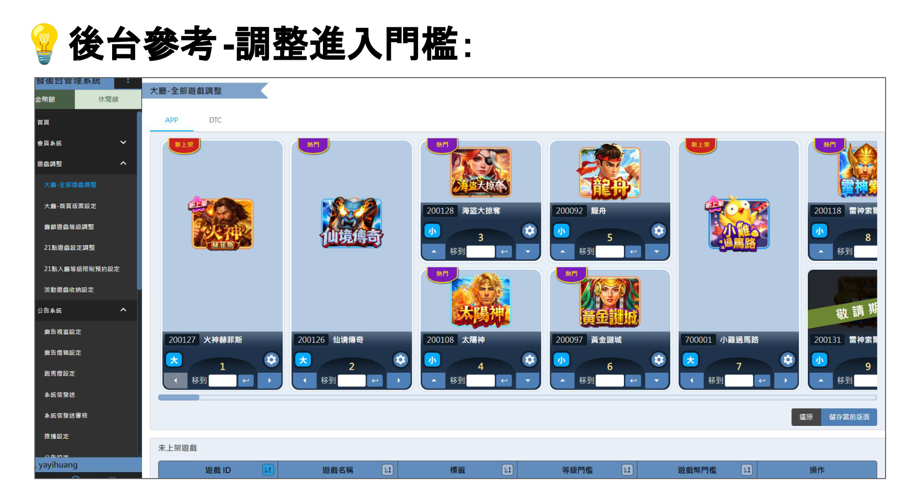
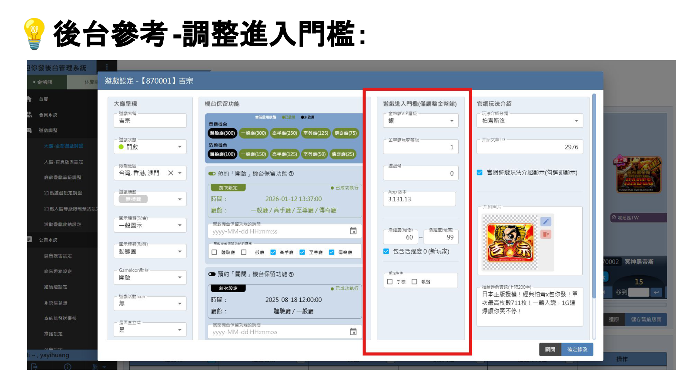
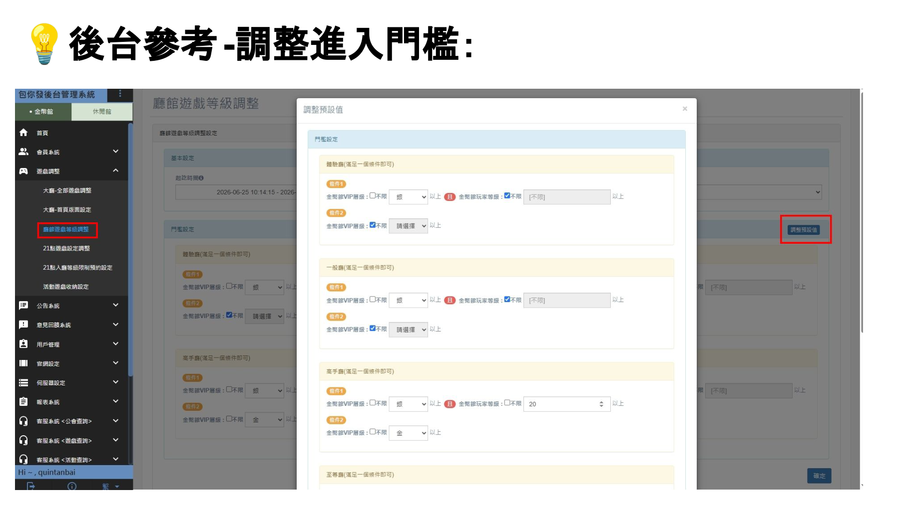

 遊戲調整流程 

> 版本：v1.0　撰寫日期：2026-07-31　BY yayihuang-bit
> ⚠️ 版本、撰寫日期、BY 都需要手動填寫更新

## 介面圖／官網 Help 說明調整

遊戲介面圖或官網 Help 說明本身要更新時，流程請參考[文案調整－修改現有INFO](/sop-docs/文案調整/#modify-info)

## 調整進入門檻（舉例：VIP、等級等）

需提前公告給玩家，至少需於調整前一天進行官網文章、APP公告

需要檢查以下內容，並通知對應窗口：

1. 官網調整：[官網-遊戲說明]({{ links.game_website_info_folder }})、[VIP 層級表格](https://drive.google.com/drive/folders/1ROZ83xDibrOgM8Yd6aJC56bnEq3O4TEq)是否需要更新，[修改流程](/sop-docs/文案調整/#modify-info)

2. APP內調整：[遊戲導引](https://drive.google.com/drive/folders/1cB2Mlsiah27ltEGx7JWixmILmHL0aOCS)、[會員系統](https://drive.google.com/drive/folders/1vLlPlHJ1SKfMc7Q_4byhF2nqDNOluKEe)（美術、RD、QA、維運負責），完成後於 Slack [包你發-營運組]({{ links.ops_group_slack }})、[包你發-維護or更新]({{ links.ops_maintenance_slack }})通知

    建議一併檢查：[新手教學](https://drive.google.com/drive/folders/192f6_O3JWYaX7M8tynI7z0a-ajwa7dYe)（基本不影響）、[新手任務](https://drive.google.com/drive/folders/10nbFmmuO_xK4DlTavFjNmLuw1n6eGLtH)（可能會有相關任務）

    > 以上皆不須送審，APP 內基本上是 BUNDLE 更新即可
    > 會員層級表格顯示有誤主要是 RD 修正，與美術無關

3. 以上皆完成後，於 LINE「包你發-客服小組」通知客服＆行銷修正內容及時間

4. 於更新日，至後台調整進入門檻

    ⚠️ 後台有兩個地方要調整：大廳-全部遊戲調整、廳館遊戲等級調整

    

    

    

5. 公告時間，需與遊戲調整更新時間一致

## 遊戲關閉

**遊戲關閉流程**

1. 釋出關閉資訊，企劃同步給各端點[準備遊戲下架文案](https://drive.google.com/file/d/1BOOBDeWv23Ea2OqQB3_NDpNhfC0Uaoat/view?ths=true)（官網／公告都要上）——維運、行銷窗口巧妙分工：一邊釋出關閉資訊，一邊[官網關閉遊戲公告](https://online808.com/news/3240)並請行銷確認產包、廣告預計下架時間

2. 同步各單位資訊後確認關閉時間 → 確認關閉時間

3. 確認後同步三件事：企劃於遊戲關閉前一週設定公告、下架官網燈箱圖；同步行銷、維運實際關閉日期；同步給客服釋出關閉資訊（哪款遊戲／時間）

    ⚠️ 建議遊戲關閉前有一週準備時間

**關閉前一天－關閉當日**

1. 於維運群提醒並追蹤執行狀態
2. 關閉當日，遊戲進維護
3. 維運執行 QA 測試
4. 企劃於後台遊戲設定關閉遊戲
5. 確認皆 OK 後完成下架

> [流程圖網址](https://reurl.cc/7bOVOk)、[下架文案參考](https://online808.com/news/3240)，產包確認狀態
> ⚠️ 預計下架遊戲請勿外流
> 目前遊戲關閉後，前端會隱藏卡片的顯示，但卡片實際還是存在

## 遊戲臨時維護

流程請參考[點我](https://docs.google.com/document/d/1QGq3G_FxlZLs0VNSc9trO6oV0oflj7eFsysxzY-LUCs/edit?tab=t.xlm1olymrs95)

德州跟柏青斯洛等桌次維護不太一樣，主要由維運處理（[詳細規格資料夾](https://drive.google.com/drive/folders/1ngeer6FKz4jr9yh0h3MlPyDN1gRYMldl)）

後台是在「遊戲設定 → 遊戲狀態」改成「維護中」。

## 商品／刮刮卡下架預告

1. 若從上層收到訊息要執行下架等動作，需發布官網／APP 公告與通知窗口

2. 窗口：
    - LINE 客服／行銷：「包你發-客服小組」
    - 行美：「弈樂_行銷/企劃討論區」
    - SLACK 維運：[包你發-維護or更新]({{ links.ops_maintenance_slack }})

    ⚠️ 若有任何活動圖片有包含相關素材，皆須調整

3. [促銷商品下架參考](https://online808.com/news/2855)、[刮刮卡下架參考](https://online808.com/news/3211)
