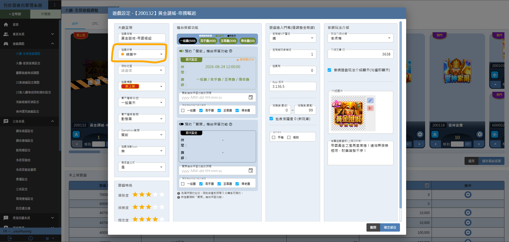

 遊戲調整流程 

> 版本：v1.0　撰寫日期：2026-07-31　BY yayihuang-bit
> ⚠️ 版本、撰寫日期、BY 都需要手動填寫更新

## 介面圖／官網 Help 說明調整

遊戲介面圖或官網 Help 說明本身要更新時，流程請參考[文案調整－修改現有INFO](/sop-docs/文案調整/#modify-info)

## 調整進入門檻（舉例：VIP、等級等）

需提前公告給玩家，至少需於調整前一天進行[官網文章](https://online808.com/news/3639)、APP公告

<mark>**需評估當前是否有相關營運活動**</mark>

<mark>**下方項目為目前已知範例，反映當下最新盤點結果；若後續沒有持續維護更新，內容僅供參考，仍須以實際狀況為準**</mark>

需要檢查以下內容，並通知對應窗口：

1. 官網調整：[官網-遊戲說明]({{ links.game_website_info_folder }})、[VIP 層級表格](https://drive.google.com/drive/folders/1ROZ83xDibrOgM8Yd6aJC56bnEq3O4TEq)是否需要更新，[修改流程](/sop-docs/文案調整/#modify-info)

2. APP內調整：[遊戲導引](https://drive.google.com/drive/folders/1cB2Mlsiah27ltEGx7JWixmILmHL0aOCS)、[會員系統](https://drive.google.com/drive/folders/1vLlPlHJ1SKfMc7Q_4byhF2nqDNOluKEe)（美術、RD、QA、維運負責），完成後於 Slack [包你發-營運組]({{ links.ops_group_slack }})、[包你發-維護or更新]({{ links.ops_maintenance_slack }})通知

    建議一併檢查：[新手教學](https://drive.google.com/drive/folders/192f6_O3JWYaX7M8tynI7z0a-ajwa7dYe)（基本不影響）、[新手任務](https://drive.google.com/drive/folders/10nbFmmuO_xK4DlTavFjNmLuw1n6eGLtH)（可能會有相關任務）

    > 以上皆不須送審，APP 內基本上是 BUNDLE 更新即可
    > 會員層級表格顯示有誤主要是 RD 修正，與美術無關

3. 以上皆完成後，於 LINE「包你發-客服小組」通知客服＆行銷修正內容及時間

4. 於更新日，至後台調整進入門檻

    ⚠️ 後台有兩個地方要調整：大廳-全部遊戲調整、廳館遊戲等級調整

    

    

    

5. 公告時間，需與遊戲調整更新時間一致

## 遊戲臨時維護

<mark>**公告建議最晚維護前 15 分鐘發布**</mark>

- 一般遊戲：流程請參考[點我](https://docs.google.com/document/d/1QGq3G_FxlZLs0VNSc9trO6oV0oflj7eFsysxzY-LUCs/edit?tab=t.xlm1olymrs95)
- 德州、柏青斯洛等桌次維護不太一樣，主要由維運處理（[詳細規格資料夾](https://drive.google.com/drive/folders/1ngeer6FKz4jr9yh0h3MlPyDN1gRYMldl)）

後台是在「遊戲設定 → 遊戲狀態」改成「維護中」。

## 遊戲關閉

### 一、遊戲關閉影響範圍

遊戲關閉前，各單位需確認相關項目：

- 廣告及宣傳素材：包含官網燈箱、各平台廣告等
- 道具卡
- 產包
- 遊戲內活動：確認是否仍有進行中的活動及後續處理方式
- 寶物市場：由維運下架該遊戲相關卡片、道具

> 注意事項：
> 遊戲關閉後，若玩家仍持有相關道具，道具卡資料仍會保留，但前台將不再顯示
> 遊戲關閉後，寶物市集或贈禮仍處於交易進行中，系統將自動退回至原贈送／接收玩家
> 若贈禮中心已完成贈送流程，但玩家尚未領取，該筆贈禮將不會退回；玩家後續領取時，背包中將不顯示該卡片

### 二、時程建議

<mark>**建議遊戲關閉前至少預留一個月準備時間，以利各單位完成活動確認、公告設定、廣告及素材下架、產包處理，以及相關系統作業**</mark>

### 三、遊戲關閉前期確認

1. 營運提出預計關閉遊戲資訊
    - 營運同步預計關閉的遊戲及相關資訊
    - 營運同步確認目前是否仍有進行中的相關營運活動

2. 企劃／行銷確認下架項目
    - 企劃請行銷確認該遊戲是否仍有產包、廣告等相關項目需下架
    - 依產包狀態分為：
        - 尚有產包未售完：確認剩餘產包及預計售完時間，再回報營運
        - 該遊戲無產包：確認無需處理產包，回報營運
    - 將確認結果同步回營運，由營運綜合評估遊戲實際關閉時間

### 四、確認關閉時間後同步各端點

遊戲關閉時間確認後，由企劃同步遊戲關閉資訊至各相關單位：

- 維運：同步至 Slack [包你發-維護or更新]({{ links.ops_maintenance_slack }}) 群
- 客服、CRM：同步至 LINE 群，CRM tag 億婷（避免維繫送的卡片是已經下架的遊戲）
- 行銷／美術：同步至 LINE 群

同步資訊至少包含：

- 遊戲名稱
- 實際關閉日期／時間
- 相關下架及準備事項

### 五、遊戲關閉當日

1. 於[維運群]({{ links.ops_maintenance_slack }})提醒並追蹤執行狀態（[範例討論串](https://yiletechnology.slack.com/archives/C096G8K6LJC/p1766544208801809)）
2. 關閉當日，遊戲進維護
3. 維運執行 QA 測試
4. 維運執行完畢後，企劃於後台遊戲設定關閉遊戲
5. 確認皆 OK 後完成下架

<mark>**預計下架遊戲請勿外流**</mark>

> 目前遊戲關閉後，前端會隱藏卡片的顯示，但卡片實際還是存在

## 商品／刮刮卡下架預告

1. 若從上層收到訊息要執行下架等動作，需發布官網／APP 公告與通知窗口

2. 窗口：
    - LINE 客服／行銷：「包你發-客服小組」
    - 行美：「弈樂_行銷/企劃討論區」
    - SLACK 維運：[包你發-維護or更新]({{ links.ops_maintenance_slack }})

    ⚠️ 若有任何活動圖片有包含相關素材，皆須調整

3. [促銷商品下架參考](https://online808.com/news/2855)、[刮刮卡下架參考](https://online808.com/news/3211)
