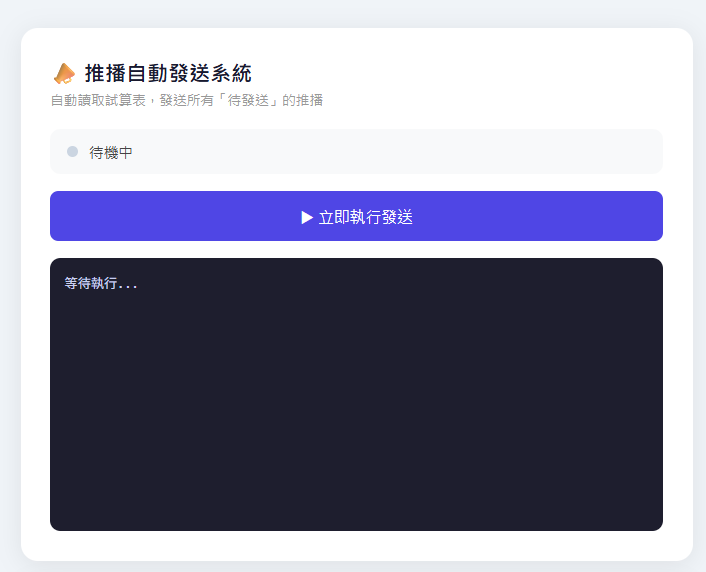
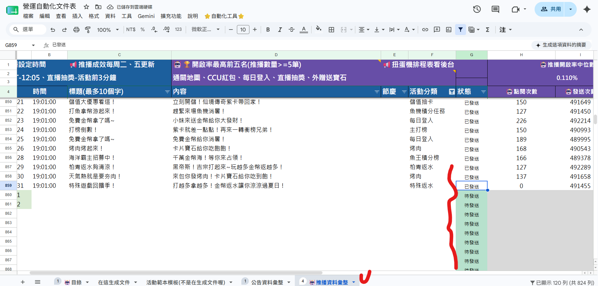
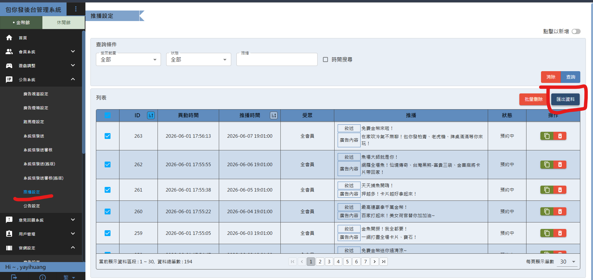
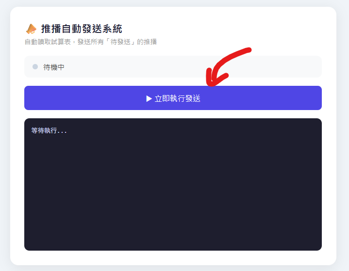
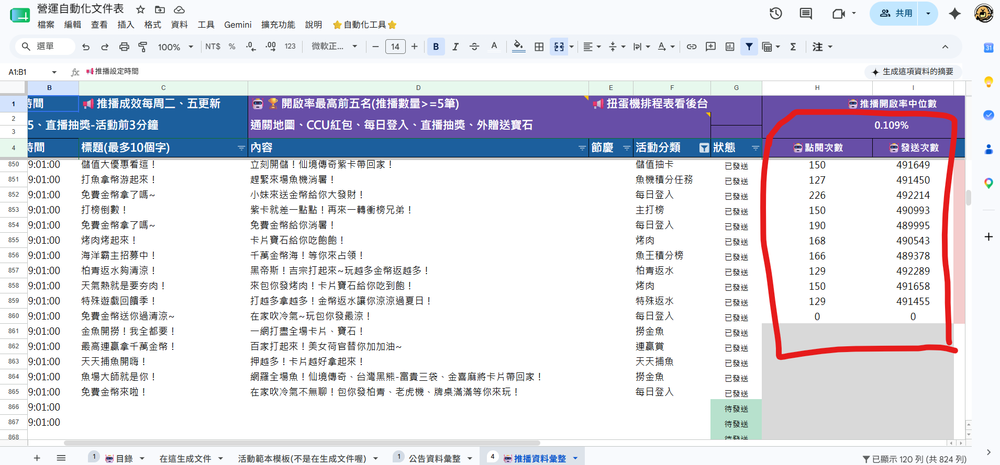

# 推播自動發送/追蹤數據系統 — 使用指南

> 版本：v1.0　撰寫日期：2026-06-01

---

## 📋 目錄

- [🏃 快速入門](#🏃-快速入門)
- [1. 環境需求](#1-環境需求)
- [2. 第一次使用新電腦](#2-第一次使用新電腦)
- [3. 功能說明](#3-功能說明)
  - [3.1 推播發送](#31-推播發送)
  - [3.2 統計回填](#32-統計回填)
  - [3.3 排程設定](#33-排程設定)
  - [3.4 後台帳號設定](#34-後台帳號設定)
  - [3.5 Google 帳號設定](#35-google-帳號設定)
- [4. 常見問題](#4-常見問題)

---

## 🏃 快速入門

### 這個系統是什麼？

一套**本機自動化工具**，讓你不用手動登入後台，系統會自動把 Google Sheets 上填好的推播資料送出，並把後台的成效數據回填回試算表。

### 系統架構

```
┌─────────────────────────────────────────────────┐
│  操作者（瀏覽器介面 http://localhost:3000）        │
│  推播發送 ｜ 統計回填 ｜ 排程設定 ｜ 帳號設定      │
└─────────────────┬───────────────────────────────┘
                  │ 雙擊 start.bat 啟動
                  ▼
┌─────────────────────────────────────────────────┐
│  Node.js 伺服器（ui-server.js）                  │
│  排程到時：先執行推播發送 → 完成後執行統計回填     │
└──────────┬──────────────────────┬───────────────┘
           │                      │
           ▼                      ▼
┌──────────────────┐   ┌──────────────────────────┐
│   推播發送        │   │   統計回填                │
│ auto-post-       │   │ sync-push-stats.js        │
│ from-sheet.js    │   │                           │
└────────┬─────────┘   └────────────┬──────────────┘
         │                          │
         └──────────┬───────────────┘
                    ▼
     ┌──────────────────────────────┐
     │  Playwright（系統 Chrome）    │
     │  使用已存的 Google 登入狀態   │
     └──────┬───────────────────────┘
            │
    ┌────────┴────────┐
    ▼                 ▼
┌──────────────┐  ┌────────────────────────┐
│ Google Sheets │  │ 後台推播設定頁面        │
│ 讀取待發送資料 │  │ 送出推播 / 匯出統計    │
│ 回填 G/H/I/J  │  │ xlsx 資料              │
└──────────────┘  └────────────────────────┘
```

### 這個功能可以幹嘛？

| 我想做的事 | 怎麼做 |
|-----------|--------|
| 發送推播 | 在 Google Sheets 填好資料，點「立即執行發送」|
| 查看推播成效數據 | 點「匯入統計數據」，系統自動回填 |

---

## 1. 環境需求

1. **Node.js** → [點我下載](https://nodejs.org) LTS 版本
2. **Google Chrome** → [點我下載](https://www.google.com/chrome)（通常已有）
3. **VPN 開通後台** → [點我前往](https://backstage.online808.com/login) / [VPN 教學](https://drive.google.com/drive/folders/12kSNMBHpvaeUGErRM99tWFED5KPWBIQ4?usp=sharing)
4. **試算表使用權限** → [點我開啟](https://reurl.cc/lpbgOd)

---

## 2. 第一次使用新電腦

**只需做一次，之後不用重複。**

### 步驟 1：安裝 Node.js

1. 前往 [https://nodejs.org](https://nodejs.org)
2. 點選左邊「LTS」版本下載
3. 執行安裝檔，一直按「Next」直到完成
4. 安裝完後**重新啟動電腦**

### 步驟 2：確認有 Google Chrome

如果沒有，前往 [https://www.google.com/chrome](https://www.google.com/chrome) 安裝。

### 步驟 3：雙擊 `start.bat` 啟動
- 第一次會自動安裝套件，多等幾秒
- 系統開啟後瀏覽器會自動打開介面



> 💡 第一次執行時，系統會自動開啟瀏覽器要求登入 Google 帳號，完成後關閉瀏覽器即可，之後不需要重複登入。

---

## 3. 功能說明

[▶ 觀看操作示範影片](參考影片/demo.mp4)

### 3.1 推播發送

**用途**：自動把 Google Sheets 裡狀態為「待發送」的推播逐筆送出後台。

**操作步驟**：

1. 在 [試算表](https://reurl.cc/lpbgOd) 填好推播資料（日期、時間、標題、廣告內容、狀態填「待發送」）
2. 到 `start.bat` 開啟的介面，點「立即執行發送」

3. 系統自動發送，完成後 G 欄會自動標記「已發送」

---

### 3.2 統計回填

**用途**：自動從後台取得推播成效數據（點閱次數、發送次數、開啟率），回填到試算表 H / I / J 欄。


**操作步驟**：
1. 點「匯入統計數據」

2. 系統自動登入後台、匯出資料、比對試算表並寫入


> ⚠️ 若有推播資料在試算表中找不到對應列，系統會彈出視窗通知。

---

### 3.3 排程設定

**用途**：設定每天自動在指定時間執行「推播發送」與「統計回填」。


**操作步驟**：
1. 在排程設定輸入時間（例如 `10:00`）
2. 點「儲存」
3. 保持 `start.bat` 的 cmd 視窗開著

系統在設定的小時內自動執行一次，當天不會重複執行。
執行順序：**推播發送完成後，再自動接續統計回填**。

---

### 3.4 後台帳號設定

**用途**：修改登入後台用的帳號與密碼。


**操作步驟**：修改完點「儲存」，下次執行自動生效。

> ⚠️ **注意：** 若儲存後執行功能時登入後台失敗，重新在此輸入正確帳號密碼並儲存即可，儲存後的設定會覆蓋舊的紀錄。

---

### 3.5 Google 帳號設定

**用途**：重新綁定 Google 帳號（換帳號或登入狀態失效時使用）。

**操作步驟**：
1. 點「重新登入 Google 帳號」
2. 在開啟的瀏覽器完成 Google 登入
3. 關閉瀏覽器，完成

---

## 4. 常見問題

**Q：出現「node 不是內部或外部命令」**
A：Node.js 沒裝好，重新執行步驟 1，裝完重開電腦。

**Q：出現 `EADDRINUSE: address already in use :::3000`**
A：Port 3000 已被佔用，表示系統已在背景執行中。關掉所有 `start.bat` 的 cmd 視窗、關掉瀏覽器裡已開啟的介面頁面，再重新雙擊 `start.bat`。

**Q：出現 RBAC access denied**
A：刪掉 `系統資料\google_auth` 資料夾，重新登入 Google 帳號。

**Q：換新電腦，推播跑不動**
A：執行一次「重新登入 Google 帳號」重新授權，通常就能解決。

**Q：後台介面有更換，腳本失效**
A：雙擊 `點我錄製腳本.bat`，錄製後提供給 AI 重寫程式碼。

**Q：試算表欄位調整了（欄位順序或名稱有變）**
A：試算表欄位與腳本的對應是寫死在程式裡的，欄位一旦異動需同步更新程式碼。提供新的欄位結構給 AI，請 AI 修改 `src\auto-post-from-sheet.js` 的欄位對應邏輯。

**Q：後台推播填寫欄位有新增或更動**
A：雙擊 `點我錄製腳本.bat` 重新錄製操作流程，連同新的欄位需求一起提供給 AI 重寫程式碼。

**Q：推播發送錯誤，需要修正重發**
A：1. 到後台把已發送的推播刪掉　2. 在試算表上直接覆蓋該列為正確內容　3. G 欄狀態改回「待發送」　4. 點「立即執行發送」重新發送

**Q：後台網址有更換，要怎麼改**
A：修改 `src\auto-post-from-sheet.js` 第 12 行與 `src\sync-push-stats.js` 第 11 行的 `BACKEND_URL`。
